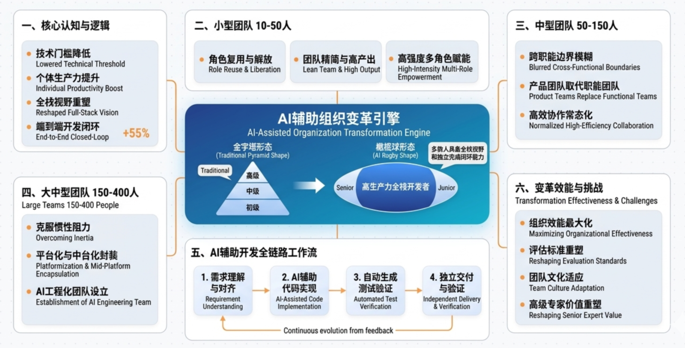
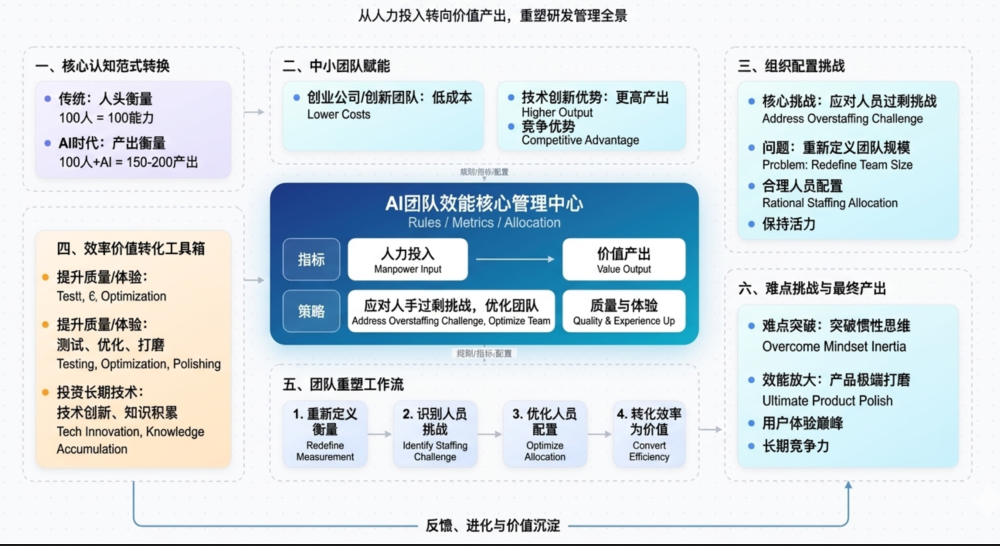

# AI 大模型时代中小软件研发公司团队如何变革的研究报告？

## 引言

人工智能大模型技术的迅猛发展正在深刻重塑软件研发行业的格局。从 GitHub Copilot 到 Cursor，从Claude到 GPT-5，AI辅助编程工具已经从概念验证阶段全面进入生产环境，彻底改变了代码编写、调试和交付的方式。

这一变革不仅仅体现在工具层面，更在深层次上影响着团队的组织结构、研发流程、人员能力模型乃至整个行业的思维范式。

对于中小型软件研发公司而言（团队规模在 10 人到 400 人之间），这场变革既带来了前所未有的机遇，也伴随着严峻的挑战。

规模较小的团队往往具有更高的灵活性和更快的决策速度，能够更迅速地拥抱新技术带来的变革；然而有限的资源储备和相对单一的技能结构也可能成为转型的障碍。规模较大的团队虽然拥有更丰富的技术积累和更完善的组织体系，但既有的流程规范和组织惯性可能会延缓变革的进程。

本文旨在系统性地分析 AI 大模型时代中小软件研发公司在团队组织、研发流程、人员能力等方面将要经历和正在经历的变革，深入探讨哪些流程和方法将发生根本性转变，哪些核心价值和方法论将保持其持久生命力，以及程序员和团队管理者应当如何调整思维模式以适应这一全新的技术环境。

通过对这些问题的深入剖析，为中小软件研发公司的管理者和技术负责人提供具有实际指导意义的洞察与建议。

---

## 第一部分：团队组织架构的变革

### 一、传统组织结构的局限性

在传统的软件研发组织中，团队结构通常呈现为清晰的金字塔层级体系。

以典型的 100 人研发团队为例，其组织结构可能包括：

技术副总裁或 CTO 一人，下设多个技术总监或技术经理（通常管理 20 至 30 人），每个技术总监下设若干技术组长或项目经理（管理5至 8 人），每个小组再包含若干高级工程师、中级工程师和初级工程师。

这种层级分明的组织结构在过去的软件开发实践中发挥了重要作用，它明确了职责边界，建立了清晰的晋升通道，并通过层层审核机制保证了代码质量和项目进度。

然而，这种传统的组织结构在 AI 时代面临着显著的效率瓶颈。

- 首先，过多的层级导致了信息传递的延迟和失真，一个技术决策可能需要在多个层级之间来回传递和确认，消耗大量时间和精力。

- 其次，传统的层级结构强调“人的复用”，即通过增加人力来提升产出，这在知识密集型的软件开发中往往收效甚微——代码评审、架构设计、系统集成等工作并不能简单地通过增加人手来加速。更重要的是，传统的组织结构将人视为可替代的资源单元，忽视了每个开发者独特的创造力、判断力和领域专长，在AI工具日益普及的今天，这种管理哲学正在变得过时。

传统组织结构的另一个显著问题是能力边界的固化。

在瀑布式开发或传统敏捷开发的框架下，团队成员往往被限定在特定的职能范围内：产品经理负责需求，设计师负责界面，开发工程师负责代码，测试工程师负责质量保障。

这种精细的职能分工在工业时代的生产制造中效率很高，但在软件研发领域却导致了严重的沟通成本和知识壁垒。当产品需求发生变化时，需要协调多个职能团队才能完成一个看似简单的功能；当代码出现问题时，开发者可能需要等待测试人员的反馈才能定位问题根源。AI 工具的出现正在打破这些边界，让一个人能够独立完成更多的工作，这意味着传统的职能分工正在失去其存在的必要性。

### 二、AI时代团队结构的演进方向

随着 AI 辅助编程工具的普及，软件研发团队的组织结构正在经历从“金字塔”向“橄榄球”形态的深刻转变。所谓“橄榄球”形态，是指团队中间层次的程序员数量大幅增加，而底层初级程序员的数量相对减少。在这一形态中，大部分团队成员都具备较强的独立工作能力和全栈视野，他们能够在AI工具的辅助下独立完成从需求理解到代码实现再到测试验证的完整闭环。

这种组织结构变化的核心逻辑在于：

AI 工具极大地提升了单个开发者的生产力。以 GitHub Copilot 为例，根据微软和 GitHub的联合研究，使用Copilot的开发者平均每天能够多完成 55% 的代码编写任务。更重要的是，AI工具不仅仅是加快了编码速度，更重要的是它降低了技术门槛，让更多开发者能够胜任原本需要更高技术等级才能完成的工作。这意味着团队不再需要大量的高级工程师来承担复杂的技术任务，也不需要大量的初级工程师在高级工程师的指导下完成简单任务，取而代之的是大量的“全栈开发者”，他们借助AI工具能够独立完成端到端的开发工作。

在 10 至 50 人的小型团队中，这种变革表现得最为直接和剧烈。

这类团队通常资源有限、人员精简，在传统的组织模式下往往需要创始人或技术负责人扮演多重角色，既要负责架构设计，又要参与具体编码，还要管理项目和团队。AI工具的出现让这种高强度的多角色工作成为可能——技术负责人可以将更多的精力投入到架构设计和业务决策中，而将具体的代码实现工作交给AI辅助的开发者完成。更重要的是，小型团队可以借助AI工具实现“小团队、大产出”的目标，原本需要 20 人才能完成的开发任务，现在可能只需要 10 到 12 人就能高质量地完成。

在 50 至 150 人的中型团队中，组织变革更多地体现在团队边界的模糊化和跨职能协作的常态化。

随着AI工具接管了大量重复性的编码工作，传统的按照技能划分的团队结构正在让位于按照业务领域划分的“产品团队”。在这种团队结构中，每个产品团队都包含了产品、设计、开发、测试等不同职能的人员，他们围绕一个共同的产品目标协同工作。AI工具让这种跨职能协作变得更加高效——产品经理可以直接通过自然语言描述来生成原型代码，开发者可以使用AI工具快速实现功能而无需深入了解所有技术细节，测试人员可以利用AI工具自动生成测试用例并识别潜在的缺陷。

在150 至 400 人的较大团队中，组织变革的核心主题是“平台化”和“中台化”。

这类规模的团队通常已经建立了相对完善的技术体系和流程规范，但在拥抱 AI 工具时面临着更大的惯性阻力。一个有效的策略是将 AI 能力封装为内部平台或工具链的一部分，让开发者能够在熟悉的工作流程中自然地使用 AI 工具，而无需大幅改变现有的工作方式。同时，较大规模的团队需要专门设立 AI 工程化团队，负责评估、引入、定制和优化AI工具，确保AI能力能够在整个组织范围内得到有效利用。

### 三、新兴岗位与能力模型

AI 时代的软件研发团队正在催生一系列新兴岗位，这些岗位代表了未来研发组织中不可或缺的核心能力。

AI 研发工程师是其中最为关键的新兴角色之一，这一岗位的职责是开发和维护 AI 辅助编程工具的底层能力，包括提示词工程、模型微调、上下文管理、与开发工具链的集成等。AI 研发工程师不仅需要具备传统的软件工程能力，还需要深入理解大语言模型的工作原理、局限性以及最佳实践应用方式。根据 LinkedIn 2024 年的职业趋势报告，AI 工程师已经成为全球增长最快的技术岗位之一，年增长率超过200%。

AI 工具管理员是另一个正在兴起的重要岗位。在大型研发团队中，AI工具的引入和管理需要专业的协调工作，包括评估和选择适合团队需求的AI工具、制定使用规范和安全策略、管理AI工具的企业许可证和权限、监控和优化AI工具的使用效果等。这一角色类似于传统的IT运维或DevOps工程师，但专注于AI工具这一新兴领域。

提示词工程师是 AI 时代独有的新兴职业。虽然“提示词工程师”这一称谓可能显得有些不够技术化，但其所代表的技能确实是AI时代软件研发中极为重要的能力。提示词工程师的职责是设计和优化与AI工具交互的提示词模板、工作流程和反馈机制，以最大化AI工具的产出质量和效率。这一能力在可预见的未来将成为每个软件开发者都需要掌握的基础技能，但专门设立这一岗位可以确保团队在使用AI工具时达到最佳实践水平。

与此同时，传统岗位的能力要求正在发生显著变化。架构师的角色正在从“技术权威”向“技术向导”转变。在传统模式下，架构师需要精通各种技术，才能做出正确的架构决策并指导开发者实现。在 AI 时代，架构师的核心价值更多地体现在系统级的设计能力、跨领域的整合能力以及对业务需求的深刻理解上——具体的代码实现可以交给 AI 工具完成，但系统的整体结构和演进方向仍然需要经验丰富的架构师来把控。

测试工程师的角色也在经历深刻的转型。传统的测试工作以手工测试和自动化测试脚本的编写为主，在 AI 时代，测试工程师需要更多地关注测试策略的设计、测试用例的生成、AI生成代码的验证以及测试基础设施的维护。AI 工具可以自动生成大量的测试用例，但如何选择有价值的测试场景、如何评估AI生成测试的质量、如何设计能够有效发现AI盲点的测试策略，这些都需要测试工程师的专业判断。

### 四、团队规模的战略重新定义

AI 时代的团队规模概念正在被重新定义。

传统上，团队规模通常以“人头数”来衡量，一个 100 人的研发团队意味着需要 100 名全职员工。但在 AI 时代，这种衡量方式正在变得过时。同样是 100 人的团队，如果他们高效地使用AI工具，其实际产出可能相当于传统模式下150 人甚至 200 人的团队。因此，管理层需要重新思考团队规模的衡量标准，从“人力投入”转向“价值产出”。

对于中小型软件公司而言，这一转变意味着更少的人可以做更多的事。这对于创业公司和技术创新团队是一个巨大的利好——他们可以用更低的成本实现更高的产出，从而在竞争中获得优势。

但这一转变也带来了人员配置上的挑战：随着单个开发者产出的提升，团队可能面临“人手过剩”的问题。如何重新定义团队规模、如何合理配置人力资源、如何在效率提升的同时保持团队的创新活力，这些问题都需要管理者认真思考。

一个可能的解决方案是将AI带来的效率提升转化为产品质量和用户体验的提升，而非单纯的人员裁减。团队可以利用 AI 工具进行更充分的功能测试、更精细的性能优化、更完善的用户体验打磨，这些工作在没有AI工具的情况下可能因为资源限制而被搁置。此外，效率提升也可以让团队有更多的时间进行技术创新和知识积累，这些长期投资对于公司的持续发展至关重要。

---

## 第二部分：研发流程的演进

### 一、敏捷开发的核心原则与AI适应性

要理解 AI 时代研发流程的变化，首先需要深入分析敏捷开发的核心原则及其与 AI 工具的兼容性。敏捷开发的四大核心价值观——个体和互动高于流程和工具、可工作的软件高于详尽的文档、客户合作高于合同谈判、响应变化高于遵循计划——从根本上讲是为了提高软件开发的适应性和响应速度。

这些价值观与 AI 工具的核心价值具有高度的一致性：AI 工具正是通过提升开发效率来增强团队响应变化的能力。

Scrum 作为敏捷开发最流行的框架之一，其核心流程包括 Sprint 计划会议、每日站会、Sprint 评审和 Sprint回顾。在 AI 时代，这一框架的基本结构保持不变，但各环节的内涵正在发生深刻变化。Sprint 计划会议在AI时代需要更加关注“意图表达”而非“实现细节”。

传统的Sprint计划往往需要详细讨论每个任务的技术实现方案，而在AI辅助编程的环境下，计划会议的重心应当转向需求的业务价值、用户体验目标和系统架构考量，这些是AI工具目前难以独立完成的工作。

每日站会的内容也在发生变化，开发者不再需要详细汇报每个代码块的进展，而更多地关注障碍识别、方向调整和跨模块协作。

Kanban 方法以其灵活的可视化管理和持续交付特性，在AI时代展现出更强的适应性。Kanban 的核心是可视化价值流动、限制在制品数量、管理前置时间。在AI工具的辅助下，团队可以在 Kanban 看板中引入新的状态列，如“A I生成中”、“AI 代码审查”等，以更好地追踪 AI 辅助开发的工作流程。同时，在制品限制（WIP Limit）的概念也需要扩展，不仅要限制人类开发者同时处理的任务数量，还要考虑 AI 工具的处理能力和输出质量。

### 二、哪些流程环节将被 AI 自动化

AI 工具正在深刻改变软件开发的各个环节，从需求分析到代码实现，从测试验证到部署运维，AI的影响力无处不在。在代码实现环节，AI辅助编程工具已经能够根据自然语言描述或注释自动生成代码，完成从简单函数到复杂模块的实现。根据 GitHub 的统计数据，GitHub Copilot已经为超过 100 万开发者提供了代码补全服务，平均每十个生成的代码建议中就有七个被开发者采纳使用。

在测试环节，AI 工具正在发挥越来越重要的作用。传统的测试工作需要测试工程师手动编写测试用例，这一过程既耗时又容易遗漏边界情况。AI工具可以通过分析代码逻辑自动生成测试用例，识别潜在的边界条件和异常场景。更先进的AI系统甚至能够自动执行测试、识别失败原因并提出修复建议。根据IBM的研究，使用AI辅助测试可以将测试用例的生成效率提升60%以上，同时将缺陷发现率提高30%到40%。

代码审查是另一个正在被 AI 深刻改变的环节。传统的代码审查依赖人工进行，既耗时又难以保证一致性。AI 代码审查工具可以自动检测代码中的潜在缺陷、安全漏洞、风格不一致和性能问题，提供即时的反馈和建议。GitHub 的AI代码审查工具可以自动识别超过50种常见的安全漏洞，准确率超过 80%。这些工具不仅可以加速代码审查流程，更重要的是可以确保审查标准的严格一致执行。

在文档生成方面，AI 工具正在大幅降低文档维护的成本。传统的软件开发中，文档往往滞后于代码更新，导致文档与实际实现脱节。AI工具可以自动分析代码变更生成更新日志，从代码注释和接口定义生成 API 文档，根据代码逻辑自动生成使用指南。这些自动化能力解决了长期困扰软件行业的文档维护难题。

DevOps 领域也在经历AI带来的变革。AI 工具可以自动分析日志数据，识别异常模式和潜在的系统问题，甚至可以预测系统故障并提供预防建议。在持续集成和持续部署（CI/CD）流程中，AI可以优化构建顺序、预测构建时间、识别构建失败的原因。在配置管理方面，AI 可以帮助生成和优化基础设施代码，降低基础设施即代码（IaC）的使用门槛。

### 三、哪些流程环节人类角色更加重要

尽管 AI 工具在多个环节展现出强大的能力，但软件开发中仍有许多环节需要人类的专业判断、创造力和情感智慧。

需求分析和产品设计是人类创造力发挥的核心领域。

虽然AI可以帮助生成用户界面的初稿或提供功能建议，但理解用户的深层需求、把握产品的发展方向、平衡商业目标和用户体验，这些工作需要人类的产品思维和商业洞察。AI工具可以提供大量的方案选项，但最终选择哪个方案、如何权衡各种利弊，仍然需要人类决策者做出判断。

架构设计是另一个 AI 难以替代的人类专业领域。

系统架构涉及复杂的技术选择、业务权衡和未来演进考量，需要架构师综合运用技术知识、业务理解和行业经验做出决策。虽然AI可以帮助评估架构方案的可行性、识别潜在的技术风险、提供相似案例的参考，但架构设计的核心——在复杂约束条件下找到最优解——仍然是人类智慧的专长。

技术决策中的价值判断是 AI 无法替代的领域。

在软件开发中，很多技术决策并非纯粹的技术问题，而是涉及团队能力、项目进度、长期维护、技术债务等多重因素的复杂权衡。AI工具可以提供各种选项的优劣分析，但最终的价值判断——什么更重要、什么可以妥协、什么必须坚持——需要人类管理者和技术负责人来做出。

团队协作和人际沟通是软件开发中不可替代的人类活动。

敏捷开发强调的“个体和互动高于流程和工具”这一价值观在 AI 时代变得更加重要。AI 工具可以提高个人的工作效率，但团队协作中的信任建立、冲突解决、知识共享、创意碰撞，这些都需要真实的人际互动才能实现。技术团队的文化建设、成员的成长发展、团队的凝聚力，这些软性因素对于团队长期绩效的影响可能远超流程和方法论的作用。

### 四、精益开发的演变与深化

精益开发的核心思想——消除浪费、持续交付价值、快速验证假设——与AI工具的能力具有天然的契合性。在AI时代，精益开发的实践正在经历深化和扩展。“消除浪费”的理念获得了新的内涵：AI工具可以帮助识别和消除传统开发中难以发现的浪费，如冗余代码、低效算法、重复测试等。AI还可以通过分析代码变更历史和团队协作模式，识别流程中的瓶颈环节和改进机会。

“构建-测量-学习”的反馈循环在 AI 时代可以运转得更快更有效。通过AI辅助的快速原型开发和自动化测试，团队可以在更短的时间内验证更多的假设，更快地获得用户反馈，更敏捷地调整产品方向。这种加速的反馈循环是精益开发追求的核心目标，AI工具使其得到了前所未有的强化。

精益创业方法论中强调的“最简可行产品”（MVP）概念在AI时代获得了新的实现方式。传统的MVP开发需要投入相当的开发资源来构建一个具备核心功能的原型。在AI辅助编程的环境下，构建MVP所需的开发工作量大为减少，团队可以更快地验证想法、获得反馈、迭代优化。这意味着精益开发的“快速试错”理念可以得到更彻底的贯彻。

然而，AI时代也给精益开发带来了新的挑战。AI 生成代码的质量验证成为一个新的“浪费源”。AI工具虽然可以快速生成大量代码，但这些代码的质量参差不齐，需要人工进行审查和测试，这本身就是一个耗时的工作。如何建立有效的AI代码质量保障机制，如何平衡AI生成效率和质量验证成本，这些问题需要在精益框架下重新思考。

---

## 第三部分：软件开发流程中的变与不变

### 一、永恒不变的核心原则

尽管 AI 工具正在深刻改变软件开发的方式，但软件工程的一些核心原则仍然保持着持久的生命力。

代码可读性原则不会因为 AI 的出现而过时。好的代码应当清晰、简洁、结构良好，能够被其他开发者（包括未来的自己）轻松理解。AI工具可以生成代码，但生成的是什么样的代码取决于给AI的提示词和人类开发者的代码标准。因此，培养开发者编写高质量、可读性强代码的能力仍然至关重要。

架构设计原则的持久价值。分层架构、微服务架构、领域驱动设计等架构模式所体现的设计原则——关注点分离、单一职责、开闭原则等——仍然是构建可维护、可扩展软件系统的基石。

AI 工具可以辅助实现这些架构模式，但理解为什么需要这些架构模式、如何根据具体场景选择和调整架构方案，这些能力只有通过深入学习和实践才能获得。

测试金字塔原则的有效性。单元测试、集成测试、端到端测试的分层结构之所以有效，是因为它反映了不同层次测试的成本效益比。AI时代这一原则依然有效，尽管 AI 工具可能改变各层测试的实现方式。单元测试仍然是最基础、最快速的测试层，AI 可以帮助生成单元测试代码，但单元测试的核心价值——快速反馈、高覆盖率——不变。端到端测试虽然AI可以加速其执行，但其在测试金字塔中的位置和作用不变。

代码评审的价值在 AI 时代不仅没有削弱，反而得到了增强。

代码评审不仅是发现缺陷的手段，更是知识共享、团队协作、技能提升的重要机制。AI工具可以自动发现代码中的很多问题，但代码评审中的人际互动、经验分享、团队文化建设等功能是AI无法替代的。事实上，AI 时代代码评审的重心可以从“找问题”转向“学习交流”，因为很多技术问题可以交给AI工具来处理。

### 二、正在加速消亡的实践

一些传统的软件开发实践在 AI 时代正在加速走向消亡。手工编写标准化的样板代码是一个正在消失的活动。

现代编程语言和框架本身就在不断减少样板代码的使用，AI 工具更是加速了这一趋势。开发者不再需要记忆和手写大量的模板代码，AI可以根据上下文自动生成所需的代码结构。这意味着开发者应当把更多的精力投入到业务逻辑的实现和系统架构的设计上，而非样板代码的编写。

逐行调试正在让位于智能调试。

传统的调试方法需要开发者仔细检查代码、设置断点、逐步执行、观察变量值。在AI工具的辅助下，开发者可以通过自然语言描述问题现象，AI 可以分析代码逻辑、识别潜在的错误位置、提供修复建议。虽然深度调试某些复杂问题仍需要开发者的专业技能，但大量常见问题可以通过AI快速定位和解决。

详尽的前期设计文档正在变得不那么重要。

在传统的瀑布式开发中，详尽的设计文档是确保项目可控的重要手段。敏捷开发已经弱化了文档的重要性，AI时代更是加速了这一趋势。AI工具可以让代码本身成为最好的文档——开发者可以直接向AI询问代码的意图和实现细节，AI可以生成代码的说明和注释。因此，花费大量时间编写详尽的设计文档的投入产出比正在下降。

部分手工测试正在被自动化替代。

AI工具可以自动生成测试用例、自动执行测试、自动识别缺陷。虽然完全替代手工测试还为时过早，但大量重复性的回归测试、边界测试、烟雾测试已经可以由AI工具自动完成。测试团队应当把精力集中在探索性测试、用户体验测试、复杂场景测试等AI难以替代的领域。

### 三、新兴的最佳实践

AI 时代正在催生一系列新的最佳实践，

这些实践代表了软件开发的未来方向。“提示词优先”开发模式正在成为新的趋势。在开始编码之前，开发者首先设计和完善与AI工具交互的提示词，确保AI能够准确理解任务需求并生成高质量的输出。这种工作方式将“需求分析”的环节前置并深化，因为清晰地表达需求本身就是AI辅助开发的关键能力。

“AI代码审查”作为常规流程正在成为新常态。在代码合并或提交之前，使用AI工具进行自动化的代码审查，发现潜在的问题、安全漏洞和质量问题，然后再进行人工审查。这种双重审查机制可以显著提高代码质量，同时让人工审查聚焦于更高层次的设计和逻辑问题。

“迭代式原型开发”在AI时代获得了新的内涵。借助 AI 工具，团队可以更快地构建多个原型方案，快速比较和评估不同方案的技术可行性和用户体验，然后选择最优方案进行深入开发。这种方法论与精益开发的“快速验证”理念高度契合。

“持续学习”正在成为开发者的核心工作内容之一。AI 工具的能力在快速演进，新的工具和方法层出不穷。开发者需要保持持续学习的状态，不断更新自己的知识体系和技能组合。传统的“一次学习、长期使用”的知识管理方式正在被打破，取而代之的是更加动态和开放的学习模式。

---

## 第四部分：程序员思维的根本性转变

### 一、从代码实现者到系统设计者的角色升级

AI 时代对程序员最深刻的影响是重新定义了其核心价值。

在传统模式下，程序员的日常工作主要是将产品需求转化为可执行的代码。这一过程需要大量的技术知识和编码技能，但核心活动是“实现”——把别人设计好的方案用代码实现出来。在 AI 时代，AI工具正在接管越来越多的代码实现工作，程序员的角色必须从“代码实现者”向“系统设计者”升级。

系统设计能力在 AI 时代变得前所未有的重要。

当AI可以处理大部分代码实现工作时，人类开发者需要更多地思考“为什么做”和“做什么”的问题：为什么需要这个功能？它如何与系统的其他部分交互？系统应当如何演进以适应未来的需求变化？这些系统级的思考需要更宏观的视野、更深入的分析能力和更全面的技术素养。培养系统设计能力成为AI时代程序员职业发展的关键路径。

架构思维是系统设计能力的核心组成部分。

架构思维不仅仅是掌握各种架构模式和设计原则，更重要的是能够在具体的业务场景和技术约束下做出合理的架构决策。这需要开发者具备横向的技术视野，能够理解不同技术方案的优劣；需要纵向的业务理解，能够把握业务需求的本质和优先级；还需要前瞻性的思考能力，能够预见系统的演进方向和潜在的挑战。

产品思维是 AI 时代开发者需要强化的另一个重要维度。

传统的开发者往往专注于技术实现，将产品决策交给产品经理。在 AI 时代，这种分工正在变得模糊。开发者需要更多地理解产品的商业目标、用户体验、技术约束之间的关系，才能在与AI工具的协作中做出正确的决策。理解“这个功能为用户解决什么问题”比“这个功能如何实现”更能体现开发者在 AI 时代的价值。

### 二、问题定义能力的核心价值

在 AI 时代，提出正确问题的能力比提供正确答案更为重要。当 AI 工具能够快速生成代码时，人类开发者的核心竞争力转向了“定义问题”和“评估方案”。定义问题能力包括：准确理解业务需求和用户痛点，将模糊的需求转化为清晰的技术任务，识别问题的边界和约束条件，判断哪些问题是重要的、哪些问题是次要的。

批判性思维在 AI 时代变得尤为关键。AI 工具会生成大量的代码和建议，但这些输出并非总是正确或最优的。开发者需要具备评估AI输出的能力：这段代码是否正确？是否安全？是否符合系统的整体设计？是否有更好的实现方式？批判性思维帮助开发者在享受AI效率提升的同时，避免被AI的错误或局限性引入歧途。

系统化思考能力帮助开发者在更宏观的层面把握问题和解决方案。AI 工具通常在局部优化上表现出色，但在涉及系统整体权衡、长期影响、多方利益平衡时可能力不从心。开发者需要能够从系统整体的角度评估AI的建议，考虑性能、安全、可维护性、可扩展性等多个维度的平衡。

### 三、学习方式的根本性变革

AI 时代正在根本性地改变程序员的学习方式。

传统的学习模式强调知识的积累和记忆——记住语法规则、设计模式、算法原理，然后在需要时检索和应用。在 AI 时代，这种学习模式的相对价值正在下降。由于 AI 工具可以提供即时的知识检索和代码补全功能，记忆具体的语法细节和 API 签名的价值减少了。

取而代之的是“理解优先于记忆”的学习模式。

更重要的是理解原理和概念，而非记忆具体的实现细节。例如，理解递归的原理比记住递归函数的语法更重要；理解设计模式背后的设计原则比记住模式的代码结构更有价值。这种学习方式让人能够更好地与AI工具协作——只有深刻理解原理，才能给出准确的提示词，才能评估AI的输出，才能在AI失败时找到正确的方向。

“学习如何学习”的元认知能力在AI时代变得至关重要。

技术的快速演进意味着开发者需要不断学习新的工具、框架和方法论。具备高效学习能力的开发者能够更快地适应变化，在新技术出现时迅速掌握其要领。建立个人知识管理系统、保持技术敏感度、养成持续学习的习惯，这些元认知能力将成为程序员的持久竞争力。

“深度工作”的能力在碎片化的 AI 协作环境中变得更加稀缺和宝贵。

当大量的编码工作被AI工具接管后，开发者需要更多地进行深度的思考、分析和设计工作。这些工作需要长时间的专注和沉浸，是AI工具难以替代的人类独特能力。培养深度工作的能力将成为程序员提升个人价值的重要途径。

---

## 第五部分：传统开发思维的转型路径

### 一、代码洁癖与快速迭代的平衡艺术

传统的软件工程教育强调代码质量的重要性——“代码是给人类读的，顺便让机器执行”。这种理念培养了开发者的代码洁癖意识，追求清晰的结构、优雅的设计、完善的注释。在传统模式下，这种追求是有价值的——高质量的代码更易维护、更少缺陷、更具长期价值。

然而，在AI时代，这种追求质量与快速迭代的现实需求进行平衡。AI 工具的产出往往更注重功能性而非完美性，它倾向于生成能够工作的代码，而非精心雕琢的代码。

如果开发者花费大量时间追求AI生成代码的完美，就失去了使用AI工具提升效率的意义。这并不意味着代码质量不再重要，而是需要重新定义“足够好”的标准：在快速迭代的场景下，代码能够正确工作、结构基本清晰、无明显缺陷，可能就已经“足够好”了。

**平衡的艺术在于区分场景**。

在核心业务逻辑、系统的基础设施、安全关键的代码等场景下，代码质量仍然应当是首要考虑因素。但在快速验证想法、构建原型、处理一次性任务等场景下，效率可能比完美更重要。开发者需要培养判断力，根据具体的场景和上下文做出合理的权衡。

“重构思维”而非“一步到位思维”可能更适合AI时代。传统思维倾向于在首次编写时就追求完美的实现，AI时代的思维则接受首次实现的不完美，依赖于后续的重构来逐步优化。这种转变与敏捷开发的迭代理念一致，但在AI工具的辅助下，重构的成本大大降低——AI可以快速地理解和修改代码，帮助开发者更容易地进行代码优化。

### 二、技术深度与广度的重新平衡

传统的技术成长路径强调“深度优先”——先在一个领域达到专家水平，再横向扩展。成为一名 Java 专家、一名数据库专家、一名前端架构师，这种专业化的路径是传统软件行业的典型发展模式。在 AI 时代，这种路径需要与“广度优先”进行重新平衡。

AI 工具的出现降低了对每个技术领域深度掌握的必要性。

通过 AI 辅助，开发者可以使用不熟悉的语言或框架完成任务，可以调用不了解的API实现功能，可以采用没学过的设计模式进行设计。这意味着在很多场景下，“知道某个东西存在”比“精通某个东西”更有价值。

广度的价值在 AI 时代得到了提升。

当开发者具备更广泛的技术视野时，他们能够更好地进行技术选型和架构决策，能够更好地与不同技术背景的团队成员协作，能够更好地理解和满足多样化的业务需求。在AI工具的帮助下，广度可以和深度更好地结合——开发者可以快速地在广度知识和深度专业之间切换，根据具体任务的需要选择合适的策略。

然而，这并不意味着深度不再重要。在核心技术领域的深度积累仍然是开发者的重要资产。AI 工具虽然强大，但在特定领域的深度问题上仍然可能出错或给出次优的建议。具备深度专业知识的开发者能够识别这些问题，补充 AI 的不足。

此外，某些工作——如系统架构设计、复杂问题诊断、前沿技术探索——仍然需要深厚的技术积累作为基础。

### 三、人机协作思维的建立

从“竞争替代”思维到“协作增强”思维的转变是AI时代程序员最重要的心理建设。早期接触AI编程工具的开发者可能会产生一种威胁感——AI会不会取代我的工作？这种担忧虽然可以理解，但无助于职业发展。更建设性的思维是将AI视为强大的助手和工具，通过与AI的有效协作来放大自己的能力和价值。

建立人机协作思维需要理解 AI 的能力边界。AI工具在模式识别、代码生成、知识检索等方面表现出色，但在理解业务意图、把握系统全局、做出价值判断、进行创造性设计等方面仍有局限。认识到这些边界，才能更好地发挥人机各自的优势。

有效的提示词工程能力是实现人机协作的关键技能。向AI清晰地表达需求、提供充分的上下文、给出合理的约束条件，这些看似简单的任务实际上需要深刻的理解能力和表达能力。培养提示词工程能力，本质上是提升沟通和表达能力，这在人机协作的新环境下变得尤为重要。

反馈循环的建立是优化人机协作效果的重要机制。当AI的输出不符合预期时，需要能够分析原因、调整提示词、改进交互方式，逐步优化与AI的协作效果。这种持续改进的思维方式，与精益开发的持续优化理念是一致的。

### 四、质量保证范式的迁移

传统的质量保证思维强调“缺陷预防”和“完整测试”——通过完善的流程、详尽的评审、充分的测试来确保软件质量。这种思维在瀑布式开发的时代达到了巅峰，但在敏捷开发和 DevOps 的浪潮中已经开始转变。

在 AI 时代，质量保证的范式正在发生更根本性的迁移。

从“完美主义”到“快速反馈”的转变是质量思维变化的核心。传统的质量思维追求在发布前发现和修复所有可能的缺陷，而 AI 时代的质量思维更接受“持续改进”的模式——允许代码中存在一些不完美，通过持续集成、持续部署、快速反馈来快速发现和修复问题。AI 工具在这个转变中发挥了重要作用——它使快速反馈和快速修复成为可能。

从“全面覆盖”到“智能覆盖”的测试策略变化是另一个重要趋势。传统的测试策略追求测试用例的全面覆盖，认为只有覆盖了所有的代码路径和场景才能保证质量。在 AI 时代，这种策略的成本变得难以承受。更智能的测试策略是识别高风险区域、有针对性地设计测试用例、利用 AI 辅助生成边界测试，同时依赖AI代码审查来保证其他区域的基本质量。

“安全左移”和“质量内建”的理念在 AI 时代获得了新的内涵。

传统的做法是在开发完成后进行安全审查和测试，而在 AI 时代，开发者需要从编码的第一刻就考虑代码的安全性和质量，因为 AI 生成代码的安全性本身就是一个需要关注的问题。将安全和质量意识内建于开发过程，而非作为事后的检查点，成为AI时代质量保证的新范式。

---

## 第六部分：不同规模团队的实施策略

### 一、10至50人团队的敏捷转型

对于 10 至 50 人的小型研发团队，AI时代的变革既是机遇也是挑战。这类团队的优势在于决策链条短、行动迅速、试错成本低。在拥抱AI工具时，小型团队可以采取更加激进的策略，直接将AI工具深度整合到日常工作流程中，无需担心与既有流程的冲突。

在团队组织层面，扁平化的团队结构对于AI时代的小型团队更为适合。减少管理层级，让每个开发者都承担更多的自主权和责任，与AI工具赋能个体的趋势是一致的。小型团队可以考虑采用“全栈开发者+AI辅助”的模式，每个人都可以借助AI工具独立完成从前端到后端的全栈开发工作。

在流程层面，小型团队可以采用简化的敏捷实践。Sprint 周期可以更短（1至2周），站会可以更精简（15分钟以内），文档可以更少（核心信息简洁记录）。AI 工具可以帮助处理很多流程性工作，如自动生成会议纪要、自动更新任务看板、自动提醒过期事项等，让团队把更多精力集中在创造价值的工作上。

小型团队在引入 AI 工具时应当特别关注以下几个问题。

首先是工具选择，由于资源有限，应当优先选择集成度高、学习曲线平缓的AI工具，避免在配置和维护工具上花费过多精力。

其次是安全考量，小型团队可能没有专职的安全团队，需要特别关注 AI 工具可能带来的数据安全风险，确保敏感的代码和业务数据不会被不当使用。

第三是能力建设，虽然 AI 工具降低了技术门槛，但团队仍需保持一定的技术深度，避免完全依赖 AI 而失去独立解决问题的能力。

### 二、50至150人团队的系统性变革

对于50至150人的中型研发团队，变革的挑战在于如何在保持组织稳定性的同时实现有效的转型。这类规模的团队通常已经建立了相对成熟的组织架构、流程规范和技术体系，这些既有资产既是优势也是惯性来源。在引入AI工具时，需要更加系统和审慎的策略。

在组织层面，建议设立专门的AI工程化团队或工作组，负责AI工具的评估、引入、定制和推广。这个团队应当由技术能力强、视野开阔的资深工程师组成，他们能够理解AI工具的技术原理，能够针对团队的具体需求进行定制开发，能够解答其他开发者使用AI工具时遇到的问题。同时，这个团队也应当承担起AI工具使用规范制定和最佳实践推广的责任。

在流程层面，需要识别哪些现有流程可以与AI工具深度整合，哪些流程需要调整以适应AI时代的特性。以代码评审为例，传统的代码评审流程可能包括开发者的自检、同行的评审、团队的讨论等环节。在AI时代，可以在人工评审之前增加AI自动评审的环节，由AI先识别出明显的问题，节省人工评审的时间和精力。但原有的代码评审目的——知识分享、团队学习、技能指导——仍然重要，不应被完全替代。

中型团队在AI转型过程中需要特别注意以下几个问题。

- 首先是变革管理，任何组织变革都会遇到阻力，中型团队需要通过充分的沟通、培训和激励来推动AI工具的采用。

- 其次是标准化与个性化的平衡，既要建立统一的使用规范和最佳实践，又要允许不同团队根据自身特点进行调整。

- 第三是效果评估，建立衡量AI工具使用效果的指标体系，定期评估AI投资的价值产出，确保转型投入物有所值。

### 三、150至400人团队的渐进式演进

对于150至400人的较大规模研发团队，变革的复杂性和挑战性显著提升。这类团队通常拥有多个产品线或技术团队，组织结构更为复杂，决策链条更长。在拥抱AI工具时，渐进式的演进策略可能比激进的变革更为稳妥。

在组织层面，建议采用“试点-推广-深化”的三阶段策略。首先选择一至两个具有创新精神和变革意愿的团队作为试点，充分尝试各种AI工具和方法，总结经验教训。然后将试点成功的做法在更大范围内推广，通过标杆效应和经验分享来带动其他团队的跟进。最后在深化阶段，将AI能力整合到组织的核心基础设施和平台中，实现AI能力的规模化应用。

在技术层面，较大规模的团队需要考虑AI工具与企业现有技术栈的深度整合。这可能包括：在IDE中集成AI代码补全功能，在CI/CD流水线中加入AI代码审查步骤，在知识管理系统中引入AI搜索和推荐，在项目管理工具中增加AI辅助的任务分解和进度预测等功能。这些整合工作需要专业的技术团队来完成。

较大规模团队在AI转型中面临的独特挑战包括：不同团队之间的协调和一致性问题，AI工具使用带来的安全和合规风险，变革过程中的沟通和培训成本，以及如何衡量和证明AI投资的ROI。应对这些挑战需要高层的支持和推动，需要专门的资源投入，需要建立有效的治理机制。

---

## 第七部分：面向未来的建议与展望

### 一、技术领导者应当采取的行动

作为软件研发团队的技术领导者，在 AI 时代需要采取一系列战略性行动来引领团队成功转型。

首先，技术领导者需要亲自体验和评估AI工具。只有亲身体验，才能真正理解 AI 工具的能力、局限和最佳使用方式，才能做出明智的技术决策，才能有效地指导和培训团队成员。

其次，技术领导者需要重新定义团队的能力模型和人才标准。传统的编程能力、算法知识、系统设计能力仍然重要，但需要与AI协作能力、持续学习能力、系统思维等新能力进行整合。招聘时需要考察候选人对AI工具的熟悉程度和使用经验，内部晋升时需要评估团队成员适应AI时代的能力潜力。

第三，技术领导者需要推动组织文化的变革。鼓励实验、容忍失败、快速学习是新技术的采用所需要的文化特质。技术领导者需要以身作则展示对AI工具的开放态度，需要创造安全的创新环境让团队敢于尝试新事物，需要建立知识分享机制让最佳实践得到传播。

第四，技术领导者需要平衡短期效率提升和长期能力建设之间的关系。利用AI工具提升短期产出是必要的，但不应当以牺牲团队的技术积累和能力发展为代价。技术领导者需要确保团队在享受AI效率红利的同时，保持对新技术的敏感度和深度钻研的能力。

### 二、个人开发者应当发展的能力

对于软件开发者个人而言，在 AI 时代保持竞争力需要发展一套新的能力组合。AI工具的使用能力是最基本的要求。熟悉主流的AI辅助编程工具，理解它们的工作原理和能力边界，掌握高效使用它们的技巧和方法，这是每个现代开发者都应当具备的基础技能。

业务理解能力的价值在AI时代得到了提升。当代码实现的工作被AI接管后，对业务的深入理解成为开发者差异化价值的重要来源。理解业务背景、把握用户需求、洞察商业价值，这些能力帮助开发者在与AI的协作中做出正确的决策，补充AI在业务理解方面的不足。

系统思维能力的价值同样得到了提升。在技术实现可以交给AI完成的情况下，如何设计系统架构、如何权衡技术方案、如何把握系统的演进方向，这些都需要系统级的思维能力。培养系统思维能力需要广泛学习各种架构模式和设计原则，需要积累处理复杂系统的实践经验，需要保持对技术趋势和行业动态的关注。

沟通协作能力在 AI 时代变得尤为重要。

虽然 AI 可以处理大量的技术工作，但团队协作、跨职能沟通、客户互动等涉及人际交往的工作仍然需要人类来完成。提升沟通能力，包括清晰地表达技术问题、准确地理解他人意图、有效地说服和影响他人，这些软技能将成为开发者的持久竞争优势。

### 三、行业发展的前瞻性展望

展望未来，AI 与软件开发的融合将继续深化和扩展。

在技术层面，AI工具的能力将持续提升，从当前的代码补全和生成向更高级的功能演进——自动设计系统架构、自动优化代码性能、自动识别和修复安全漏洞、自动生成完整的测试套件等。开发者需要保持持续学习的状态，跟上技术发展的步伐。

在组织层面，软件研发团队的组织形态将继续演进。随着AI能力的增强，单个开发者的产出将继续提升，团队规模可能进一步精简。传统的职能团队可能让位于更加灵活的项目制团队或社群化组织。远程协作和全球化人才利用也将因为AI工具的普及而变得更加普遍和高效。

在流程层面，软件开发流程将进一步向“智能化”演进。AI将不仅辅助执行层面的工作，还将更多地参与计划、决策、优化等更高层次的活动。智能化的项目管理工具可以自动分解任务、预测风险、优化资源；智能化的知识管理系统可以自动组织和关联技术文档、代码案例和经验教训；智能化的质量保障系统可以自动识别和修复缺陷、优化性能和安全性。

在人才层面，“AI原生开发者”这一新类别可能出现——他们从职业生涯一开始就习惯于在 AI 辅助下工作，天生具备与 AI 协作的思维方式和技能。对于这一代人，传统意义上的很多编程技能可能变得不再必要，而AI协作能力、创造性问题解决能力、系统思维能力将成为他们教育的重点。

---

## 结语

AI 大模型时代为中小软件研发公司带来了前所未有的机遇和挑战。

在这场深刻的变革中，团队组织正在从传统的金字塔结构向更加扁平、更加灵活、更加智能的形态演进；研发流程正在经历从传统敏捷向 AI 增强的敏捷的转变，某些环节被自动化替代，而人类的核心价值在更高层次的活动中得到彰显；程序员的能力模型正在从传统的编码能力向设计能力、系统思维、人机协作等更综合的方向升级；传统的开发思维正在与时俱进，在保持核心价值的同时适应新的技术环境和商业现实。

对于 10 至 400 人规模的中小型软件研发公司而言，这场变革既是挑战也是机遇。小型团队可以凭借其灵活性快速拥抱变化，在AI时代占据先机；中型团队可以凭借其积累既有优势，同时保持必要的敏捷性；较大规模的团队则需要更加审慎和系统性的变革策略。无论规模大小，关键在于认识到变革的必然性，积极拥抱变化，同时保持对核心价值的坚持。

AI 不会取代软件开发者，但掌握 AI 的开发者将会取代不掌握 AI 的开发者。

这句话虽然耳熟能详，但其中蕴含的洞见仍然值得我们深思。在 AI 时代，最成功的软件开发者不是那些与 AI 竞争的人，而是那些能够与AI 有效协作、发挥人机各自优势的人；最成功的软件团队不是那些完全依赖AI的团队，而是那些能够在利用 AI 提升效率的同时保持创新能力和技术深度的团队。

变革已经开始，未来已来。

中小软件研发公司的管理者和技术负责人需要现在就开始行动，为团队和个人的 AI 时代转型做好充分的准备。在这个过程中，既要有紧迫感和主动性，也要有战略定力和长期视角；既要充分利用AI带来的效率红利，也要守护软件开发中不可替代的人类智慧和创造力。唯有如此，才能在 AI 时代的大潮中立于不败之地，实现持续的成长和成功。