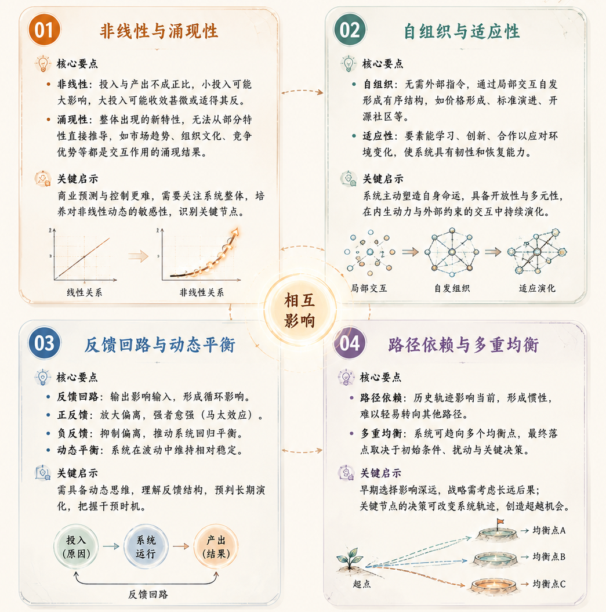
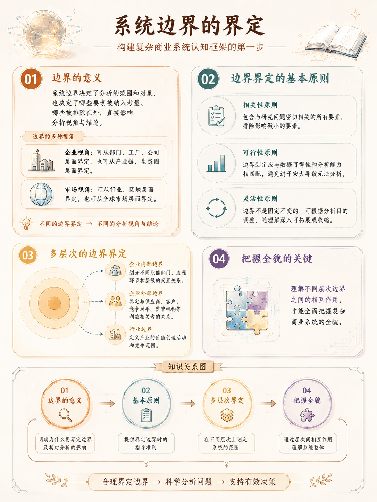
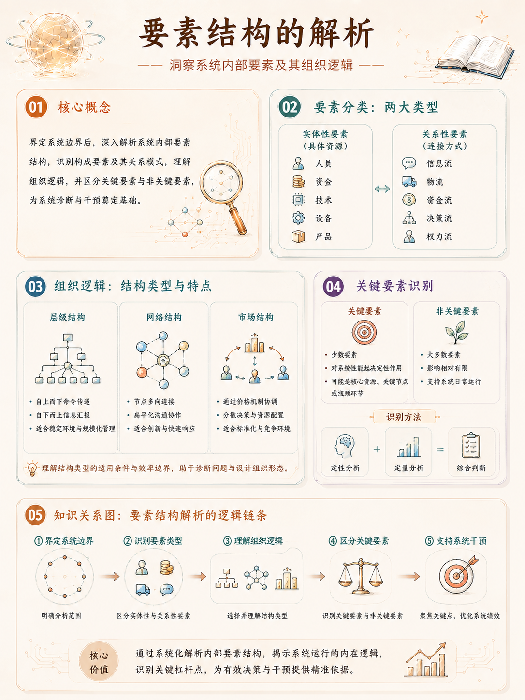

复杂商业系统完整认知框架

## 一、引言：理解当代商业的复杂性

当代商业环境已经发生了根本性的变革，企业所面对的不再是简单的线性系统，而是一个由多元主体、多重因素、多层结构交织而成的复杂生态系统。

从全球化供应链的纵横交错，到数字技术的深度渗透，从消费者行为的快速演变，到政策法规的动态调整，商业系统的复杂性以指数级的速度增长。在这种背景下，传统的还原论思维——即将复杂系统分解为简单部分分别研究——已经难以揭示商业现象的全貌和本质。

复杂商业系统的认知框架旨在提供一种整体性、系统性的思维方式，帮助管理者和研究者穿透表象，把握商业运作的深层逻辑。这种框架不是简单的工具箱，而是一套理解复杂性的认识论和方法论体系。

它要求我们从**孤立思维转向关联思维，从静态分析转向动态观察，从线性预测转向情景推演**。只有建立起这样的认知框架，才能在充满不确定性的商业世界中做出更为明智的决策。

理解复杂商业系统的认知框架具有多重价值。对于企业领导者而言，它提供了战略思考的高维视角，有助于识别系统性风险和把握结构性机遇。对于咨询从业者而言，它是分析问题的有力框架，能够支撑更深层次的洞察和建议。对于学术研究者而言，它是理论建构的重要基础，可以推动商业研究从碎片化向系统化方向发展。

## 二、复杂商业系统的核心特征

### 2.1 非线性与涌现性

复杂商业系统的第一个显著特征是非线性关系。

在线性系统中，投入与产出成正比，原因与结果成比例，这是传统经济学和管理学的基本假设。然而，在真实商业世界中，变量之间的关系往往是高度非线性的。小规模的投入可能产生巨大的影响，而大规模的投入可能收效甚微，甚至适得其反。例如，一项看似微小的技术创新可能引发整个行业的颠覆性变革，而大量的管理改进措施可能在面对组织惯性时收效甚微。

与非线性密切相关的另一个特征是涌现性。

涌现是指系统整体层面出现的、无法从部分特性直接推导出的新特性。在商业系统中，涌现现象无处不在。市场趋势的形成不是单个消费者行为的简单加总，而是无数个体交互作用的涌现结果；组织文化的塑造不是个体态度的简单平均，而是在持续互动中涌现的新型集体行为模式；竞争优势的构建也不是资源能力的简单堆砌，而是在特定时空条件下涌现的独特能力组合。理解涌现性意味着我们必须关注系统整体，而非仅仅聚焦于构成要素。

非线性与涌现性共同构成了复杂系统的本质挑战。它们意味着，商业预测和控制比传统理论所假设的要困难得多。我们无法简单地通过分析历史数据来推断未来走向，也无法通过调整单一变量来实现预期效果。管理者需要培养对非线性动态的直觉敏感性，学会识别系统中可能引发质变的关键节点。

### 2.2 自组织与适应性

复杂商业系统的第二个核心特征是自组织能力。

自组织是指系统在没有外部指令的情况下，通过构成要素的局部交互而形成有序结构的过程。

在商业领域，自组织现象俯拾皆是：市场价格的形成是无数买卖双方自组织交互的结果；行业标准的演进是众多企业自发博弈的产物；开源社区的运作更是自组织模式的典型案例。自组织意味着，商业系统的秩序可以在没有中央计划的情况下自发产生，这挑战了传统管理理论中强调命令与控制的基本假设。

与自组织相辅相成的是系统要素的适应性。

在复杂商业系统中，组成要素——无论是个人、团队还是企业——都能够根据环境变化调整自身行为。这种适应性既表现为学习能力，即从经验中提取规律并优化决策；也表现为创新能力，即在面对新挑战时创造新的应对策略；还表现为合作能力，即与其他主体建立新的协作关系以应对共同挑战。适应性使得商业系统具有显著的韧性，能够在面对冲击时进行调整和恢复。

自组织与适应性揭示了商业系统演化的内在动力。

系统不是被动地接受外部环境的塑造，而是主动地参与自身命运的塑造过程。这种主动参与使得商业系统的未来路径具有开放性和多元性，既不是完全由初始条件决定，也不是完全由外部力量支配，而是在内生动力与外部约束的交互作用中不断展开。

### 2.3 反馈回路与动态平衡

复杂商业系统的第三个特征是反馈回路的普遍存在。反馈回路是指系统的输出作为输入影响系统后续行为的过程。

在商业系统中，正反馈回路和负反馈回路无处不在。正反馈回路放大偏离：成功吸引更多资源，更多资源带来更大成功，形成强者愈强的马太效应；负反馈回路抑制偏离：成本上升压缩利润，利润下降抑制扩张冲动，从而推动系统回归平衡。理解反馈回路对于分析商业动态至关重要，因为同一个变量在不同的反馈结构中可能产生截然不同的效应。

反馈回路的存在使得复杂商业系统呈现出动态平衡的特征。与静态均衡不同，动态平衡是一种在运动中维持的状态，系统围绕某个中心点或轨道不断波动，但不会完全偏离。企业的市场份额可能在一定范围内波动，行业的利润率可能在长期中趋向某个平均水平，经济的增长路径可能在不同阶段展现不同特征。动态平衡意味着，商业系统既不会无限扩张，也不会彻底崩溃，而是在多空力量的持续博弈中寻找平衡点。

反馈回路与动态平衡的特征要求管理者具备动态思维。

线性思维倾向于寻找因果关系的终点，而动态思维关注的是持续进行中的循环过程。理解系统中的反馈结构有助于我们预判行为模式的长期演化，识别系统稳定性的边界条件，以及发现干预系统的最佳时机。

### 2.4 路径依赖与多重均衡

复杂商业系统的第四个特征是路径依赖性。

路径依赖意味着，系统的当前状态不仅取决于当前的条件，还深受历史演进轨迹的影响。一旦系统进入特定的发展轨道，由于规模效应、学习效应和协调效应的作用，它倾向于继续沿着这条轨迹演进，而难以轻易转向其他可能同样可行甚至更优的路径。在商业实践中，路径依赖解释了为什么企业往往难以摆脱既有的战略惯性，为什么市场格局一旦形成往往具有相当的稳定性，以及为什么后发追赶需要付出更大的努力。

与路径依赖相关的是多重均衡的可能性。

复杂商业系统通常不是只有单一的可能状态，而是在不同条件下可能趋向多个不同的均衡点。

这些均衡点可能是稳定的，也可能是不稳定的；可能是高效的，也可能是低效的。系统最终停留在哪个均衡点，取决于初始条件、随机扰动和关键决策的时机。

多重均衡的存在意味着，商业系统的未来不是单向决定的，而是存在多种可能性，关键节点的选择可能将系统引向截然不同的轨迹。

路径依赖与多重均衡的洞见对于战略决策具有重要启示。它提醒我们，早期的选择和积累具有长期影响，战略规划需要考虑长远后果而非仅仅关注眼前利益。同时，它也表明，在关键节点上，正确的判断和果断的行动可能改变系统的演进方向，为后来者提供超越的机会。

## 三、完整认知框架的构成要素

### 3.1 系统边界的界定

构建复杂商业系统认知框架的第一步是合理界定系统的边界。

系统边界决定了我们分析的范围和对象，也决定了哪些要素被纳入考量、哪些被排除在外。在商业分析中，边界界定绝非易事：企业可以从部门、工厂、公司的层面界定，也可以从产业链、生态圈的层面界定；市场分析可以从行业、区域的层面界定，也可以从全球市场的层面界定。边界界定的不同将导致分析视角和结论的重大差异。

边界界定需要遵循几个基本原则。

- 首先是相关性原则，即边界应当包含与研究问题密切相关的所有要素，而排除影响微小的要素。

- 其次是可行性原则，即边界划定应当与数据可得性和分析能力相匹配，过于宏大的边界可能导致分析无法进行。

- 第三是灵活性原则，即边界不是固定不变的，而是可以根据分析目的进行调整，随着理解的深入可以拓展或收缩。

在实践中，系统边界通常需要在多个层次上同时界定。企业内部边界划分不同职能部门、流程环节和层级的交互关系；企业外部边界界定与供应商、客户、竞争对手、监管机构等利益相关者的关系；行业边界则定义产业的价值创造活动和竞争范围。

理解不同层次边界之间的相互作用，是把握复杂商业系统全貌的关键。

### 3.2 要素结构的解析

界定系统边界之后，需要对系统内部的要素结构进行深入解析。

要素结构分析包括识别系统的主要构成要素，以及这些要素之间的关系模式。在复杂商业系统中，要素可以分为实体性要素和关系性要素两类。实体性要素包括人员、资金、技术、设备、产品等具体资源；关系性要素包括信息流、物流、资金流、决策流、权力流等连接方式。

要素结构解析的重点在于理解系统的组织逻辑。

不同的组织逻辑将要素组合成不同的结构类型。层级结构强调自上而下的命令传递和自下而上的信息汇报；网络结构强调节点之间的多向连接和扁平化沟通；市场结构则通过价格机制协调分散的决策。每个结构类型都有其适用条件和效率边界，理解结构类型有助于诊断现有组织的问题和设计新的组织形态。

要素结构分析还需要关注关键要素和非关键要素的区分。

在复杂系统中，并非所有要素对系统行为都有同等影响。少数关键要素对系统性能起着决定性作用，而大多数非关键要素的影响相对有限。识别关键要素是有效干预系统的前提。关键要素可能是核心资源、关键节点或瓶颈环节，其识别需要结合定性和定量的分析方法。

### 3.3 互动模式的识别

复杂商业系统的行为很大程度上取决于要素之间的互动模式。互动模式分析关注的是系统内部的信息传递、决策协调、资源流动和冲突调和机制。不同的互动模式会产生不同的系统行为和演化路径。

互动模式可以从多个维度进行分析。

- 从频率维度看，有一次性互动和重复性互动，重复互动为声誉机制和信任关系的建立提供了条件。

- 从强度维度看，有弱联系和强联系，弱联系往往在信息传递和机会发现方面具有独特优势。
- 从方向维度看，有单向和双向互动，双向互动为反馈和学习提供了基础。
- 从规则维度看，有正式互动和非正式互动，两者共同塑造着系统的协调机制。

在商业系统中，典型的互动模式包括竞争与合作、命令与服从、交易与交换、沟通与协调等。这些模式往往不是孤立存在，而是在不同情境下混合出现。

企业与竞争对手之间既有竞争也有合作，与供应商之间既有交易也有协作，内部部门之间既有分工也有协调。理解这些互动模式的混合和转换，是把握复杂商业系统动态的关键。

### 3.4 演化机制的把握

复杂商业系统是动态演化的系统，而非静态固定的结构。

演化机制分析关注系统如何随时间变化、变化的动力来源以及可能的演化路径。

演化机制包括变异机制、选择机制和保留机制三个基本环节。

- 变异机制产生系统状态的多样性，如产品创新、商业模式创新或组织变革；

- 选择机制筛选适合特定环境的状态，如市场竞争、优胜劣汰；
- 保留机制使适应性的状态得以延续，如知识积累、能力沉淀。

演化机制分析需要区分渐进式演化和突变式演化。渐进式演化是系统状态的连续变化，通常源于边际改进和路径依赖；突变式演化是系统状态的非连续变化，通常源于技术突破、制度变革或外部冲击。

两种演化模式在商业实践中都普遍存在，理解它们的触发条件和作用机制对于战略预见具有重要价值。

演化机制分析还需要关注演化的方向性和目的性。

虽然复杂系统不存在中央意图，但演化并非完全随机。系统与环境的适应关系为演化提供了方向指引，系统内部的竞争和选择机制则提供了演化的动力。理解演化的方向性有助于预判系统的发展趋势，理解演化的动力来源则有助于识别推动或引导演化的杠杆点。

## 四、认知框架的应用方法

### 4.1 多层次分析策略

将认知框架应用于实践的首要策略是采用多层次分析视角。复杂商业系统的分析需要在不同层次之间灵活切换，既要有宏观视野把握全貌，也要有微观视角深入细节。

**常用的分析层次包括宏观层次（行业、经济体、全球市场）、中观层次（企业、组织、价值网络）和微观层次（个体、团队、流程节点）**。

多层次分析的核心洞见在于理解跨层次关系。宏观环境的变化会影响中观层面的竞争格局和资源配置，中观层面的企业行为会塑造微观层面的个体行为和互动模式；反过来，微观层面的创新和变革可能累积为中观层面的结构性变革，最终引发宏观层面的范式转换。这种跨层次的因果关系和反馈机制是复杂系统分析的关键。

多层次分析策略要求分析者具备概念切换的灵活性。在分析具体问题时，需要根据问题的性质选择恰当的分析层次。同时，当问题涉及多个层次的交互时，需要能够同时在多个层次上进行分析，并清晰地区分不同层次的效应。这种分析能力的培养需要大量的实践训练和理论学习。

### 4.2 动态视角的培养

动态视角是应用复杂系统认知框架的核心能力。

动态视角要求分析者不是关注系统的某个静态截面，而是关注系统的变化过程、历史轨迹和未来可能性。静态分析告诉我们系统当前是什么样子，动态分析则揭示系统如何变成这个样子以及将会变成什么样子。

培养动态视角需要掌握几种基本的动态分析工具。系统动力学提供了分析反馈结构和时间延迟的方法；演化经济学提供了理解路径依赖和动态适应的框架；博弈论提供了分析策略互动和均衡演化的工具。这些工具各有侧重，需要根据具体问题选择合适的工具组合。

动态视角还要求分析者具备时间尺度的敏感性。

不同类型的变化发生在不同的时间尺度上：技术变革可能需要数年乃至数十年；市场格局的变化可能需要数年；运营决策的效果可能在数月内显现；日常管理的调整可能立即产生效应。理解不同时间尺度上的变化规律及其相互作用，是把握复杂系统动态的重要能力。

### 4.3 情景规划的方法

面对复杂商业系统的不确定性，情景规划是一种特别有价值的分析方法。情景规划不是预测未来会出现什么，而是探索未来可能出现的多种状态，以及在不同状态下应该如何应对。情景规划的价值在于，它帮助决策者拓展思维边界，考虑那些在确定性思维模式下可能被忽视的可能性。

情景规划通常包括几个关键步骤。首先是识别影响系统发展的关键不确定因素，这些因素应当是对系统状态有重大影响但结果难以确定的变量。其次是构建少数几个内部一致的未来情景，每个情景代表关键因素的一种特定组合。第三是分析每个情景下系统的特征和行为模式，以及对不同利益相关者的影响。第四是制定应对不同情景的策略，并识别在所有情景下都适用的稳健策略。

情景规划的有效实施需要平衡想象力和严谨性。情景既要足够大胆以挑战思维定势，又要足够合理以保持分析价值。情景的数量也要适度，过少可能遗漏重要可能性，过多则难以形成清晰的战略含义。通常，三到四个精心设计的情景是比较合适的。

### 4.4 系统干预的设计

认知框架的最终目的是指导实践，特别是指导对复杂系统的干预设计。系统干预不同于传统的线性干预，它关注的是如何通过精心设计的行动引发系统整体的变化，而非仅仅改变某个局部变量。系统干预的核心挑战在于找到杠杆点——即那些微小变化能够引发系统性连锁反应的节点。

系统干预设计需要遵循几个基本原则。

- 第一是诊断优先原则，在干预之前必须对系统结构有深入理解，错误的诊断可能导致无效甚至有害的干预。
- 第二是反馈意识原则，任何干预都会产生反馈效应，这些反馈可能强化也可能削弱干预的效果，干预设计必须考虑这些反馈机制。
- 第三是演化适应原则，干预不是一次性的行动，而是持续调整的过程，需要根据系统响应不断优化干预策略。

识别杠杆点是系统干预设计的关键技能。杠杆点通常位于系统的关键节点、瓶颈环节或反馈结构的关键连接处。

增强正反馈回路可以加速系统向目标演化，削弱负反馈回路可以消除进步的障碍；调整系统边界可以改变问题的定义方式；改变信息流动可以改变参与者的认知和行为。杠杆点的识别需要对系统结构的深刻理解和创造性思维的结合。

## 五、认知框架的实践价值

### 5.1 战略决策的深化

复杂商业系统认知框架对战略决策具有深远的价值。传统战略分析往往聚焦于行业结构、竞争对手和自身资源，虽然有其价值，但容易陷入静态分析的局限。

引入复杂系统视角后，战略决策获得了新的维度：动态竞争成为关注焦点，企业不仅需要分析当前的竞争格局，还需要预判竞争动态的演化方向；生态系统思维得到强化，企业战略不再仅仅是在既定行业中竞争，而是参与塑造整个商业生态系统；路径依赖被纳入考量，战略选择需要考虑对后续发展的影响和灵活性空间的保留。

认知框架还提供了新的战略工具。蓝海战略的创造可以通过改变系统边界、重新定义竞争维度来实现；平台战略的设计需要理解网络效应和自组织机制；数字化战略的制定需要把握技术变革的动态规律和反馈机制。这些战略工具只有在复杂系统的认知框架下才能得到深入理解和有效应用。

更重要的是，复杂系统认知框架培养了战略思考的深度和广度。深度体现在能够穿透表象，把握系统行为的深层逻辑；广度体现在能够关联思考，将看似独立的因素纳入统一的分析框架。这种思考能力的提升是认知框架最根本的价值，它不仅适用于商业分析，也适用于面对各种复杂问题时的理性思考。

### 5.2 组织管理的优化

在组织管理领域，复杂商业系统认知框架提供了独特的价值。传统的管理理论往往假设组织是可以被精确设计、计划和控制的对象，这种假设在稳定环境中具有一定的适用性，但在快速变化的环境中显得捉襟见肘。复杂系统视角下的组织管理强调自组织、适应性和涌现性，为应对当代组织挑战提供了新的思路。

组织设计的优化是认知框架应用的重要领域。层级结构的僵化、网络结构的松散、市场机制的冷漠都是单一组织模式的局限。复杂系统视角倡导混合型组织模式，在不同情境下采用不同的协调机制，并根据环境变化动态调整。这种权变设计思想需要管理者对不同组织模式的特征和适用条件有深入理解。

变革管理的改进是另一个重要应用领域。复杂系统视角下的变革不再是自上而下的单向推动，而是多主体参与的共同演化过程。变革需要关注系统的反馈结构，理解变革阻力的来源和应对策略，预判变革的系统性效应，设计渐进式与激进式变革的组合方案。这种变革管理思想更加符合真实组织变革的复杂性。

### 5.3 风险管理的创新

复杂商业系统认知框架为风险管理提供了新的范式。传统风险管理侧重于识别和量化风险，然后通过保险、对冲等金融手段进行风险转移。这种方法对于独立风险事件有一定的效果，但对于系统性风险却显得无能为力。复杂系统视角下的风险管理关注风险的相互关联性、动态演化和潜在的级联效应。

系统性风险的识别是复杂风险管理的重要内容。系统性风险不是个别风险的简单加总，而是风险之间的相互作用和放大效应。在金融领域，2008年金融危机就是系统性风险的典型案例；在供应链领域，新冠疫情引发的全球供应链中断也是系统性风险的体现。识别系统性风险需要对系统结构和反馈机制有深入理解。

韧性建设是复杂风险管理的核心理念。与其试图预测和控制所有可能的风险事件，不如提升系统应对意外冲击的能力。韧性建设包括冗余设计（保持一定的过剩能力作为缓冲）、多样性培育（保持多元化的选择空间）、适应性培养（提升系统学习调整的能力）。这些原则对于应对高度不确定的商业环境具有普遍价值。

## 六、认知框架的局限与演进

### 6.1 方法论的边界

尽管复杂商业系统认知框架具有重要的价值，但我们也需要清醒认识其方法论的边界。任何认知框架都有其适用的条件和局限，复杂系统框架也不例外。首先，分析复杂系统需要大量高质量的数据和深入的洞察，在数据可得性有限或理解不够深入的情况下，分析可能流于表面。其次，复杂系统分析往往需要较高的认知能力和分析技巧，对于缺乏训练的使用者而言，可能难以有效应用。第三，复杂系统分析可能产生过多可能性，反而导致决策困难，这与决策者追求确定性的心理需求存在张力。

复杂系统框架与其他分析方法之间不是替代关系，而是互补关系。在某些情境下，传统的线性分析可能更为适用；在另一些情境下，需要结合使用多种方法。关键在于根据问题的性质选择恰当的分析方法，并根据分析的深入不断调整和优化。

### 6.2 实践中的挑战

将复杂系统认知框架应用于实践面临诸多挑战。

- 第一个挑战是沟通和共识的建立。复杂系统分析往往涉及大量变量和相互关系，分析结论可能难以用简洁的方式表达和传达。对于习惯于线性思维的决策者来说，复杂系统分析可能显得过于抽象和模糊。有效的沟通需要将复杂分析转化为清晰的洞见，并用决策者能够理解和接受的方式呈现。

- 第二个挑战是分析成本的限制。深入的系统分析需要投入大量的时间和资源进行数据收集、模型构建和情景推演。在资源有限的情况下，可能难以开展充分的分析工作。如何平衡分析深度和成本约束，是一个需要根据具体情境判断的问题。

- 第三个挑战是行动的不确定性。尽管复杂系统分析可以增进对系统行为的理解，但它无法消除不确定性。分析只能减少不确定性，而不能完全消除它。决策者需要在不确定性条件下做出决策，这需要勇气和判断力的结合。

### 6.3 框架的持续发展

复杂商业系统认知框架是一个持续演进的领域。随着商业实践的发展和新技术的涌现，认知框架需要不断吸收新的养分。在理论层面，复杂性科学、经济学、管理学等多学科的交叉融合为认知框架提供了新的理论资源。

在技术层面，大数据分析、人工智能、仿真建模等方法为复杂系统分析提供了新的工具。在实践领域，新兴商业模式和组织形态的出现为理论发展提供了新的素材。

认知框架的发展需要学术研究与实践应用的良性互动。学术研究提供理论框架和方法工具，实践应用验证理论的有效性并提出新的问题。两者的循环往复推动着认知框架的不断深化和完善。对于从业者而言，持续学习和更新知识是保持分析能力的关键；对于研究者而言，深入实践、了解真实需求是理论创新的源泉。

## 七、总结

复杂商业系统完整认知框架的建立是一项系统性工程，它要求我们从还原论思维转向整体论思维，从静态分析转向动态观察，从线性预测转向情景推演。这一框架的核心在于理解复杂系统的非线性特征、涌现效应、自组织能力和反馈动态，在于把握系统边界、要素结构、互动模式和演化机制，在于运用多层次分析、动态视角、情景规划和系统干预等方法论工具。

掌握这一认知框架的价值是多方面的。在战略层面，它拓展了决策的视野和深度，使战略思考能够把握系统性机遇和风险；在组织层面，它提供了管理变革和优化的新思路，使组织设计更加灵活和适应；在风险层面，它揭示了系统性风险的机制，使风险管理更加全面和有效。

然而，我们也必须承认认知框架的局限性和应用中的挑战。复杂系统分析不是万能钥匙，它需要与其他分析方法配合使用，需要根据具体情境灵活应用。分析成本的限制和沟通的困难是实践中需要克服的障碍。最重要的是，分析框架只是辅助工具，真正决定决策质量的还是使用者的判断力和智慧。

在商业环境日益复杂多变的今天，建立并运用复杂商业系统认知框架已经成为管理者和研究者的必备素养。这种素养不是一朝一夕可以养成的，它需要持续的学习、实践和反思。随着经验的积累，复杂系统思维会逐渐内化为一种直觉，使我们能够更加敏锐地感知商业世界的复杂性，更加有效地应对各种挑战。

这是认知框架的根本价值所在，也是我们持续探索和精进的动力之源。