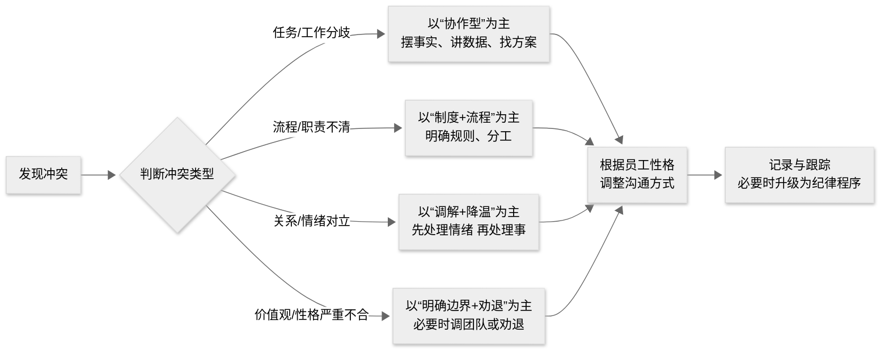

## 一、整体流程：从识别类型到选择策略

有的冲突并不是坏事情，比如任务冲突，如果能合理利用就能提升决策质量；但有的冲突需要坚决控制，比如情绪对立。  

处理冲突这里给个一般流程：

> 先判断类型，再选策略，再根据性格调整沟通方式。  

用一个流程图概括处理思路：

---
## 二、冲突类型有哪些？分别怎么处理？
### 1. 常见类型：任务、关系、流程、价值观/地位
综合组织行为学的研究，职场冲突一般分为以下几类：
1. **任务冲突**：  对做什么、做到什么程度、怎么做有分歧。  
   
   典型例子：技术方案选型、接口设计、优先级排期。
2. **关系冲突：**  对人有情绪，不喜欢、不信任、甚至厌恶。  
   
   典型例子：互相阴阳怪气、人身攻击、拉小圈子。
3. **流程/过程冲突：**  对怎么做、谁来做、流程怎么走有分歧。  
   
   典型例子：联调流程、上线流程、谁负责哪块边界不清。
4. **价值/地位冲突：**  价值观、荣誉感、地盘之争。  
   
   典型例子：抢功劳、抢资源、谁才是主负责人。
### 2. 不同类型的处理策略
#### （1）任务冲突：引导成建设性争论
研究表明，适度的任务冲突有助于提升团队决策质量，但需要管理。

下面给出一些处理方法：

- 建立对事不对人的规则：  会上鼓励争论，但禁止人身攻击。  
- 用事实+数据说话：  例如压测数据、性能指标、线上故障影响范围，而不是“我觉得”。  
- 引入第三方：  找架构师或资深开发做“裁判”，避免只凭嗓门大，就是谁有理。 
> 争论选方案，谈话示例：
>
> “我们争论的是方案本身，不是谁对谁错。现在大家把各自方案的优缺点和风险列出来，我们选一个对团队整体最优的。”
#### （2）关系冲突：先降温，再处理事
关系冲突会明显破坏团队氛围和绩效，要尽快干预。

一般处理方法：

- 先分别谈话，了解真实感受；  
- 明确边界：  可以不喜欢，但不能不合作；  
- 共同制定最低合作标准：  比如：必须回消息、必须按约定时间联调、会上发言要就事论事，不能人生攻击，情绪化发言。
> 处理谈话示例：
>
> “我理解你们彼此不太舒服，但工作上必须配合。我们可以约定：不管私下如何，工作上要做到及时响应、互相尊重。如果做不到，我会按违纪流程处理。”
#### （3）流程冲突：用制度解决，而不是吵架
很多流程冲突是因为规则不清，需要补制度，而不是每次临时吵架。

一般处理方法:

- 把争议流程固化成文档：  联调流程、上线流程、问题归属规则；  
- 开发明确接口人和兜底人：  谁负责哪个模块，出了问题找谁；  
- 用复盘会沉淀规则：  每次冲突后，补充 1–2 条规则，避免重复踩坑。
#### （4）价值/地位冲突
这类冲突往往涉及“谁说了算、谁拿功劳”。

一般处理方法：

- 明确角色与权责：  某个模块只有一个主负责人，其他人配合。  

- 把荣誉和责任一起给：  谁要当负责人，就要承担事故连带责任。  
- 通过项目复盘公开澄清贡献：  让大家看到谁实际做了什么，而不是只听谁在喊。

---
## 三、不同性格员工的冲突处理
### 1. 内向型员工

与内向型员工冲突处理原则：给空间、给时间、少公开对质

研究表明，内向者通常需要更多时间处理信息、对公开对质更敏感。

冲突时特点：不太会当场吵起来，但会憋着，事后用消极方式表达（不配合、拖延、沉默）。

**处理建议：**

- 冲突后不要立刻拉大会当众对质，先单独小范围聊。
- 给对方时间消化：  “你先想想，明天下午我们再聊一次，你有想法也可以提前写给我。” 
- 多用文字沟通：  允许对方用 IM/邮件先表达想法，再当面聊。
- 避免当众批评、当众逼问：  内向者被当众逼问容易觉得被羞辱，关系会更僵。
  

### 2. 脾气暴躁/易怒型员工

脾气暴躁/易怒型员工，这类员工在冲突中容易大喊大叫、拍桌子、说难听话，需要先降低情绪浓度。

**处理建议：**

- 第一句：先降温，把脾气降下来  ，话语：“我知道你现在很火大，先坐下，我们慢慢说。”  
- 不要跟着情绪走：  不回骂、不讽刺，语速放慢，声音适当放低。  
- 明确边界：  “可以说事，不能骂人；拍桌子、摔东西这类行为，我们团队是不接受的。”  
- 情绪很激动时，可以暂停：  “我们休息 10 分钟，等你冷静一点再继续。”
  ****
> 处理谈话示例：
>
> “你大声吼，我们没法解决问题。这样，你先冷静 10 分钟，我们再继续聊。如果你再拍桌子摔东西，我就只能按公司制度处理。”
---
## 四、严重冲突：要不要开除？什么时候开除？
### 1. 先区分：严重冲突 vs 严重违纪
- **严重冲突**：  互相大吵、冷战、严重影响团队氛围，但未触犯法律或公司红线。

- **严重违纪**：  打架、性骚扰、严重侮辱、威胁上司或同事、多次严重对抗公司制度等。

对严重违纪，可以走正式纪律程序，甚至直接开除。但要有调查、有记录、有流程，否则容易引发劳动纠纷。

### 2. 处理严重冲突的四步法
1. **事实调查**  
   - 找在场当事人单独谈话，记录时间、地点、言行。
   - 尽量有书面记录、聊天记录等证据。
2. **初步处理：劝离+记录** 
   - 如果只是吵得很凶，但未达到违纪： 
     - 先让双方分开，各自冷静； 
     - 由 leader 分别谈话，明确底线； 
     - 写下《冲突经过说明》存档。
3. **正式纪律程序（如需要）** 
   - 根据公司制度，给出口头警告/书面警告； 
   - 对严重违纪，可以按制度给最后书面警告甚至解除劳动合同。
4. **风险控制**  
   - 涉及违法（打架、骚扰、威胁），建议走公司 HR+法务流程，必要时报警。
### 3. 什么时候坚决开除？
综合 HR 实践，一般出现以下情况，会考虑严肃处理甚至解除劳动合同：
- 打架、严重身体冲突；  
- 性骚扰、严重侮辱、歧视性言论；  
- 多次严重对抗上级或同事，经多次警告无效；  
- 严重违反公司信息安全、数据安全制度；  
- 其他触犯法律或公司高压线的行为。

一些注意的点：
- 不要因为一次吵架就开除，也不要因为是技术骨干就放任严重违纪。  
- 开除是最后手段，不是首选手段。
---
## 五、常见冲突场景例子
### 场景 1：技术方案争论升级成人身攻击
**冲突场景1**：

A 和 B 在会上争论数据库选型，A 说 B 你不懂架构，B 回你只知道背书，根本不懂业务，开始互相讽刺。

**处理步骤：**

1. 立即干预：  “我们暂停一下，争论方案可以，但不要评价对方能力。”  
2. 把话题拉回方案：  “现在各自说理由，A 先说：为什么你倾向这个方案？B 记录，不要打断。”  
3. 会后分别谈话：  明确这是任务冲突，已经滑向关系冲突，不能再发生。  
4. 建立机制：  以后重大技术方案，提前在文档里写清对比维度，减少情绪化争论。
### 场景 2：联调出问题，互相推诿责任
**冲突场景2**：

前端说接口没按文档调用，后端说前端乱改参数，双方在群里互相甩锅，情绪很重。

**处理步骤：**

1. 先看事实：  拉日志、抓包，确认实际请求/响应。  
2. 组织小型复盘：  只对事，不对人， 问题是什么？  流程哪里有问题？  
3. 补规则：  接口变更必须走文档+通知；  联调前必须先对齐环境、参数。  
4. 明确下次责任归属：  谁负责接口，谁就要为文档和变更通知负责。
### 场景 3：内向员工被暴躁型同事吼
**冲突场景3**：B 脾气急，一急就大声吼，A 是内向的人，被吼后不再主动沟通，经常拖延。

**处理步骤：**

1. 先安抚 A：  “我知道昨天被吼得很难受，我们先聊聊你的感受。”  
2. 找 B 谈话：  “你着急我理解，但吼人会让对方更不愿意配合，效果适得其反。”  
3. 约定行为底线：  B 可以着急，但不能再吼；  A 可以内向，但不能用拖延表达不满。  
4. 给 A 一些支持：  让资深同事带一带，降低沟通压力；  允许 A 先用文字表达意见，再逐步鼓励当面表达。
### 场景 4：两个骨干争项目主负责人名额
**冲突场景4**：A 和 B 都想当项目主负责人，互相拆台，在会上争资源，甚至在领导面前说对方坏话。

**处理步骤：**

1. 明确规则：  主负责人 = 荣誉 + 责任，出了问题要担责。  
2. 让双方分别陈述：  为什么想做负责人？准备怎么干？能承担什么风险？  
3. 做出选择并解释：  选一个，说明理由；  对另一个给其他发展机会（如负责另一个重要项目）。  
4. 公开澄清角色：  在团队会上说明：负责人是谁，其他人如何配合。
---
## 六、冲突处理简则
1. **冲突三原则**  
   - 对事不对人。
   - 不舒服可以直说，但行为要守底线。 
   - 冲突可以，不能影响工作推进。
2. **底线行为（一经发现，严肃处理）**  
   - 人身攻击、侮辱性语言。 
   - 拍桌子、摔东西、推搡。
   - 威胁、恐吓、骚扰。
   - 多次拒绝配合且无正当理由。
3. **处理流程**  
   - 小冲突：当事人先私下沟通，沟通不了再找 leader。
   - 中度冲突：leader 分别谈话，再拉一起定规则。
   - 严重冲突：走公司正式纪律流程，HR 参与。