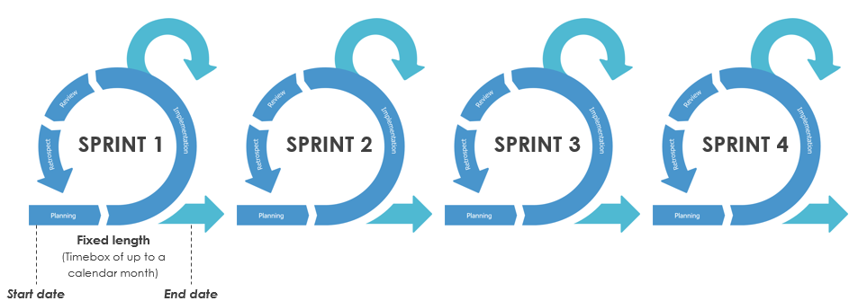
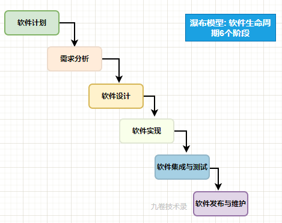
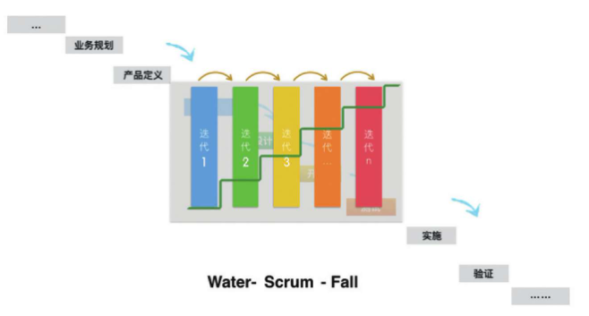
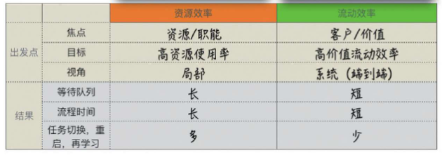

## 前言

在当今快速变化的商业环境中，软件产品开发面临着很大的挑战：需求不确定性高、竞争很激烈，传统开发的资源效率导向开发模式已难以适应这一挑战。精益产品开发作为一种新的方法论体系，旨在帮助团队从追求资源利用率，转向追求价值流动效率，从而实现交付有价值的产品这一目标。

## 传统开发模式的问题

在大多数产品开发组织中，管理者习惯性地将目光聚焦在可见的资源利用上，工程师的利用率高不高任务多不多？测试人员有没有空闲？这种思维模式看似合理，实则隐藏着一个认知偏差。

在何勉的《精益产品开发》这本书中，作者讲了一个寓言故事：

> 一个醉汉在路灯下踉踉跄跄地寻找钥匙，警察问他钥匙丢在哪里，醉汉回答说丢在远处，警察不解地问为什么在这里找，醉汉理直气壮地说：“因为只有这地方有光线，看得见啊！”

这个寓言揭示了产品开发中的一个普遍现象：人们总是聚焦于容易看到的东西，而忽略看不到的东西。各种资源（工程师、完成任务量、代码量、交付功能多少、bug数量、测试环境）是可见的，它们自然成为管理的焦点。而用户价值在组织内部的流动过程却是隐形的，从而往往被忽视。

在产品开发中，我们的问题往往从来不是停滞的资源，而是停滞的产品需求（用户价值）。

## 精益产品开发的目标

传统软件开发往往过度关注资源利用效率——即让团队成员始终处于忙碌状态，却忽视了真正的价值交付效率。

资源效率指的是从组织内部的角度，审视各个开发环节的产出效率。它关注的是每个资源节点是否被充分利用——开发人员代码提交量是否多、测试人员测试用例执行数量是否达标、设计师产出设计图是否够快。这种效率视角本质上是局部优化和资源导向的，而不是全局最优。

这种资源效率导向的思维模式导致了一个普遍现象：团队虽然高效运转，但产品却迟迟无法上线，用户需求无法得到及时满足，最终导致业务价值无法实现。

与资源效率相对应的是流动效率，流动效率则是指从用户的角度，审视用户价值顺畅流动的程度。它关注的是一个用户需求从提出到交付的整个过程中，真正创造价值的时间占比，以及过程中的等待时间和停滞点有哪些，这种流动效率视角本质上是全局优化和价值导向的。

产品开发的终极目标不是让团队忙起来，而是让正确的价值流向用户。

精益产品开发的目标：

> 顺畅地高质量交付有用的价值。

## 实现阶段的迭代

我们在敏捷开发中的目标是：更早交付价值，灵活应对变化。在 Scrum 框架中用的是 Sprint 循环迭代方法，每一个迭代周期是 2 到 4 个星期，然后上线开发的产品特性，如下图：

(图片来自：visual-paradigm.com)

整体来看，这个 Scrum 的迭代其实也是从需求分析、软件设计、程序开发到测试验收的整个过程迭代。有的人把这种开发模式叫 Water-Scrum-Fall。

这个开发环节的迭代有部分价值，在实现阶段能够及时发现技术及协作相关问题，并做出调整。但价值的交付还是很迟才能完成，而且业务闭环未能打通，得到的反馈也不够真实。 - 来自《精益产品开发》。

（部分环节阶段的迭代，无法更早交付价值 - 来自《精益产品开发》 何勉）

如何能快速交付端到端的交付价值？

精益产品开发答案：

> 从以资源效率为核心，转变为以流动效率为核心来组织产品交付过程。聚焦用户价值端到端的流动。

很多公司都宣称“以用户价值为中心”，其实做的时候却是以资源效率来做流程优化，所以结果往往没有得到理想的效果。

## 资源效率 vs 流动效率

资源效率vs流动效率对比图：

（来自《精益产品开发》 何勉）

资源效率与流动效率 2 者的差异：

- 目标不同：前者追求资源不空闲，后者追求价值快流动
- 优化对象不同：前者优化局部资源，后者优化整个系统
- 镜头对准谁：前者对准资源，后者对准流动单元
- 结果不同：前者导致局部高效、整体低效，后者实现全局优化

精益产品开发这本书中说：

> 资源效率的过度局部优化，增加了并行和排队，使用户需求走走停停，经常处于等待状态，在环节内和环节间形成队列，队列又带来额外的工作，如对其的管理、任务的切换及重启，额外知识的传递和再学习等，导致系统整体协调难度增加，让看上去很高的资源效率无法转化为真实的生产力，这是很多传统开发方式共同面对的困境。

传统模式下的团队往往同时处理多项任务，认为这样可以提高效率，但实际上，多任务切换会带来巨大的认知负担和效率损失。

需要澄清的是，资源效率和流动效率都重要。

以快递业务为例，流动效率关系客户体验和服务承诺，资源效率关系运营成本。但问题的关键：应该以哪个为核心来组织和优化用户价值交付过程？ 精益产品开发的回答是：必须以流动效率为核心，在此基础上再寻求资源效率的平衡与优化。

## 端到端的价值流动

精益产品开发强调，从用户需求到用户价值实现的端到端的完整闭环。

传统组织架构往往将开发过程分割为多个独立的阶段，每个阶段由不同的团队负责，这种职能型组织虽然职责清晰，却容易导致局部优化而忽视协同的整体效率。

精益原则要求团队以价值流为中心进行组织，打破部门壁垒，建立跨职能团队，同时协调多个团队，从端到端的视角优化整个交付流程。

精益产品开发必须聚焦流动效率，要分析和可视化用户价值端到端的流动。可以使用看板方法来可视化价值流动。

## 价值探索

聚焦流动效率解决了：如何更快交付东西的问题，但还有一个更根本的问题需要思考：

> 我们交付的东西，真的是用户需要的吗？

从产品角度来说，只有用户需要的，才是有价值。从商业角度来说，一个能卖出去的产品才是有价值的，而不是卖一个能做出来的产品。

探索和发现有用的价值，这是精益产品开发的一个核心原则，也是精益创业的精髓。

我们要关注目标客户是谁，他们有哪些未被满足的需求？我们应该构建什么样的产品来解决这些需求？这些问题我们必须时刻想着，

才有可能做出对用户哟有价值的产品。