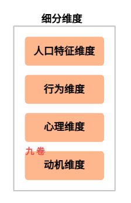
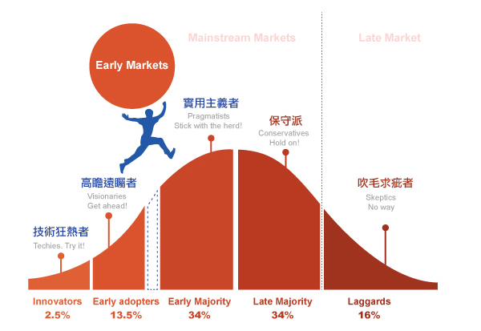

## 前言

精益产品开发就是需要顺畅的交付有用的价值。精益开发中的流动效率是怎么快速顺利交付价值的问题，那什么是价值？哪些是价值？怎么发现和探索价值？等等这些问题，是产品方向问题，是需要深刻思考的问题。

回答上面一系列问题，可以再追问 2 个根本问题：

> 解决谁的问题？解决了什么问题？
>
> 也可以理解为：目标客户是谁？识别他们未被满足的需求

## 找出用户未被满足的需求

价值探索的前提是找到目标用户或客户，然后分析、发现它们未被满足的需求。

客户未被满足的需求，又可以思考以下几个问题：

- 谁是我们的目标目标客户？
- 他们有什么痛点需求或待完成的任务？
- 这些问题的严重程度如何？
- 他们目前是怎么应对这些问题？

第一找到我们的目标客户，然后才能够去探索、理解用户未被满足的需求。我们需要花时间去理解用户，他们所在的场景和场景相关联的上下文，然后找出他们的问题、他们的期待，而不是急于给出技术解决方案或产品解决方案。这就是常说的用户需求分析。这是做有价值产品的第一步。

## 问题定义市场

另外一种思考，从问题开始。

发现一个问题，这个问题是否有很多人需要解决，这个问题的市场有多大。

丹·奥尔森提出了一个关键洞见：问题来定义市场。

一个有效的市场是有一个共同的、被满足的需求或问题定义的，而不是由一组人口统计特征或一个产品类别定义的。

举例来说，“年龄在25-35岁的女性”不是一个市场，因为她们可能有各种各样的需求。“需要一种更方便、更卫生的经期管理方式的女性”才是一个市场。同样，“想要购买汽车的人”不是一个市场，而是“需要一种能够安全、舒适地接送孩子上下学的交通工具的父母”才是一个市场。

这一洞见对产品开发有深远的意义：

当我们以问题来定义市场时，我们的竞争对手就不是其它的同类产品了，而是所有能够解决这个问题的现有方案——包括用户自己临时凑合的方案。这让我们能够更准确地评估市场机会，更清晰定位产品的独特价值。

## 市场细分

### 市场细分维度

市场细分其实就是对用户群的细分，它是确定目标用户或客户的第一步。那怎么细分市场？常用的市场细分的几个维度：

**1. 人口特征维度**

- 年龄、性别、收入、教育程度、职业、地理位置等
- 这是最基础的细分维度，但单独使用往往不足以定义有意义的市场

**2. 行为维度**

- 使用频率（高频用户 vs. 低频用户）
- 使用场景（家庭使用 vs. 办公使用 vs. 旅途使用）
- 购买渠道（线上购买 vs. 线下购买）
- 品牌忠诚度

**3. 心理维度**

- 价值观、生活方式、兴趣爱好
- 风险偏好、创新接受度
- 对品类的态度和认知

**4. 动机维度**——这是最关键的维度

- 用户想要完成什么任务（Jobs to Be Done）
- 用户遇到什么痛点
- 用户追求什么收益

有效的市场细分应该综合使用多个维度，尤其是动机维度。人口特征告诉你谁是用户，行为告诉你做什么，而动机告诉你为什么。只有理解了为什么，才能真正抓住用户需求的核心。

### 深入理解细分用户

再进行用户细分或客户细分时，必须明确指出：

> 谁是我们的主要服务对象？

如果两者都是关键角色，那么就需要为每个角色建立相应的人物模型，深入理解他们的不同需求。

比如在 B2B 业务或某些 B2C 业务中，使用者和购买者往往是分离的。例如，企业级软件的使用者可能是一线员工，而购买者是 IT 主管或财务总监。

还有，儿童产品的使用者是孩子，但购买者是孩子父母；宠物产品的使用者是宠物，但购买者是宠物的主人。

这一区分至关重要，因为使用者和购买者的需求可能完全不同，有时甚至相互冲突。使用者关心的是易用性和效率，购买者关心的是成本控制和投资回报。

一个成功的产品必须同时满足两者的关键需求，或者在两者之间找到平衡点。

## 技术采纳生命周期

杰弗里·摩尔在《跨越鸿沟》一书中提出的技术采纳生命周期，为目标客户选择提供了重要的指导框架。该理论将用户分为五个阶段：

1. **创新者**：技术爱好者，愿意尝试新产品，即使产品还不完善。他们约占市场的 2.5%。
2. **早期采纳者**：愿景者，能够看到新技术的战略价值，愿意为竞争优势冒险。他们约占 13.5%。
3. **早期大众**：实用主义者，希望看到成熟案例和可靠参考，追求的是改进而非革命。他们约占 34%。
4. **晚期大众**：保守主义者，对新技术持怀疑态度，只在迫不得已时才采用。他们约占 34%。
5. **落后者**：怀疑者，拒绝任何变化，只在新产品无法回避时才接受。他们约占 16%。

从技术采纳生命周期图可以看出，从早期市场（创新者和早期采纳者）到主流市场（早期大众和晚期大众）之间存在一道鸿沟。很多产品未能跨越这道鸿沟，是因为它们试图用吸引早期采纳者的价值主张，去吸引早期大众，结果两头都落空了。

对于新产品来说，最关键的第一步是找到并服务好早期采纳者。这些用户愿意忍受产品的不完善，愿意提供反馈，甚至愿意为产品尚未证明的价值买单。他们是最佳的种子用户，也是帮助我们验证和迭代产品的合作伙伴。

## 精益创业思维与MVP

在确定如何开发产品前，首先要想的一个问题是：开发什么样的产品？

丹·奥尔森深刻指出：很多产品失败的根本原因不是开发能力不足，而是从一开始就开发了错误的产品。

这一洞察与精益创业（Lean Startup）理念高度一致：

> 与其假设用户需要什么，不如快速验证用户真正需要什么。

最小可行性产品（Minimum Viable Product，MVP）是精益创业的核心概念，MVP 指的是能够验证用户核心需求假设的最小产品功能集合。丹·奥尔森对 MVP 的界定：MVP不是“最小的产品”，而是“能够学习到用户真实需求的最小实验”。

这意味着 MVP 的设计目的不是交付完整的功能，而是收集用户反馈、验证业务假设、验证功能是否满足用户需求。每一次产品迭代都应该围绕一个核心假设展开，通过 MVP 来快速验证假设的正确性，再根据验证结果决定下一步方向。

## 参考

- 《精益产品开发: 原则、方法与实施》 何勉 https://book.douban.com/subject/27116921/
- 《跨越鸿沟：颠覆性产品营销圣经》 [美\] 杰弗里·摩尔 https://book.douban.com/subject/3320425/
- 《如何开发一个好产品：精益产品开发实战手册》[美\]丹·奥尔森 https://book.douban.com/subject/27616940/
- 九卷读书：《跨越鸿沟》-产品和技术生命周期一点思考 https://www.cnblogs.com/jiujuan/p/12884881.html