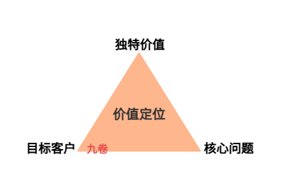
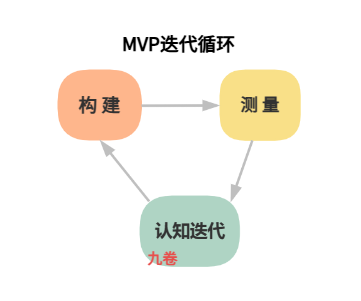
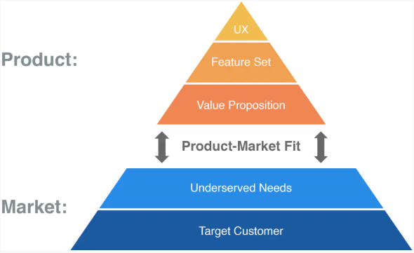

## 前言

上一篇文章中，我们探讨了如何确定目标客户，通过市场细分、技术采纳生命周期、用户分层及特征的分析等等方法来确定目标客户。以及怎么探索客户未被满足的需求，通过问题定义市场来思考、待完成任务来分析等方法深入挖掘用户真正的痛点。

根据上一篇文章的分析的客户和需求，这篇就来给出一些解决方案。

首先，要回答 2 个问题：

- 1、我们能为客户创造什么独特的价值？
- 2、我们应该构建什么样的产品来验证这个价值？

回答上面的问题：1、产品价值定位 2、MVP最小可行产品快速测试验证。

MVP 最小可行产品就是从 ：构建 - 测量 - 认知循环，来迭代、持续的验证产品的价值。

## 问题与方案探讨

上篇我们说了问题定义市场，一个有效的市场是由一个共同的、未被满足的需求定义的。这个也可以叫做问题空间的探索，明确“为谁解决什么问题”，之后就要探索和设计一个解决方案来解决这个问题，满足用户需求。

问题空间探索的结果是“做什么”的输入，而不是直接得到“怎么做”的答案。我们需要在深刻理解用户问题的基础上，进行创造性的方案设计，然后把方案带回到问题空间进行验证——这就是由外而内的产品开发。

从问题空间到方案空间的过程，本质上是收敛的过程。问题空间的探索鼓励发散——尽可能多地发现潜在需求和可能的解决方案。但到了方案空间，我们必须收敛——做出选择，确定方向。选择了一个合适的方案，就定义了产品的方向。

没有一个产品可以满足所有人的所有的需求。试图面面俱到，往往意味着平庸无奇。真正的选择，是在众多可能性中做出取舍，聚焦于最能体现产品独特价值的方向。

## 产品的价值定位

### 什么是价值定位

价值定位（Value Proposition）是对产品核心价值的简洁陈述，它回答了一个根本问题：**客户为什么要购买你的产品，而不是竞争对手的？**

一个完整的价值定位应该包含三个要素：

1. 目标客户：为谁创造价值
2. 核心问题：解决什么痛点或完成什么任务
3. 独特价值：为什么你的解决方案优于现有方案，或超过竞争对手方案

价值定位不是内部的功能列表，而是外部的客户承诺。它应该能够用一句话清晰传达，让潜在客户一听就明白：这个产品对我有什么用。

### 价值定位的4步法

**第一步：梳理客户需求的核心**

基于上一篇文章，我们可以收集并制定一份用户/客户需求清单，并明确了哪些需求是重要程度高、满意度低的机会点。现在需要从中提炼出最核心的需求——产品必须满足、否则客户不会选择你的产品。

**第二步：分析竞争对手的价值定位**

了解竞争对手如何定位，有助于找到差异化的空间。可以从以下几个维度分析：

- 他们强调的核心价值是什么？
- 他们的目标客户是谁？
- 他们的产品在哪些方面做得很好？
- 他们的产品在哪些方面存在不足？

**第三步：定义产品的独特价值**

结合客户需求的核心和竞争对手的不足，思考以下问题：

- 我们能在哪些方面比竞争对手做得更好？
- 我们能在哪些方面提供独一无二的价值？
- 如果只能用一个短语描述我们的产品，应该是什么？

**第四步：撰写价值定位陈述**

一个经典的价值定位模板是：

> 为 [目标客户] 提供 [产品/服务]，帮助他们在 [核心任务] 上 [获得收益/解决痛点]，不同于 [竞争方案]，我们的产品 [独特优势]。

例如：

Flip 摄像机的价值定位是：“为普通消费者提供一款极致易用的数码摄像机，帮助他们在日常生活中轻松捕捉和分享视频，不同于传统的复杂摄像机，我们的产品一键即可拍摄，即插即传。”

### 价值定位的验证

价值定位不是一次性的文案写作，而是需要验证的假设。

验证的一些方法包括：

1. 客户访谈：将价值定位陈述给潜在客户，观察他们的反应。他们能理解吗？他们感兴趣吗？他们认为这个价值重要吗？

2. 竞争对比：让客户比较你的价值定位与竞争对手的价值定位，询问他们更倾向于选择哪一个，以及为什么。

3. 登陆页面测试：创建一个简单的登陆页面，展示价值定位和产品概念，观察有多少访问者愿意留下邮箱“了解更多”或点击“立即购买”。

4. 众筹预售：对于硬件产品或B2C产品，众筹平台是验证价值定位的有效渠道。如果用户愿意预付，说明价值定位足够有吸引力。

## MVP最小可行产品

### MVP是什么

什么是MVP最小可行产品:

> MVP最小可行产品，是精益创业理论中用于快速验证商业模式假设的核心方法论。
>
> 它主张通过构建功能极简但能展现核心价值的可运行产品原型，收集早期用户反馈并形成“构建-测量-认知迭代”循环，以最小化试错成本实现产品迭代。

MVP最小可行产品不是：

- 不是功能残缺的半成品：MVP 必须形成一个完整的价值闭环，让用户能够完成核心任务
- 不是内部演示版：MVP 是要交付给真实用户使用，而不是只在内部演示
- 不是一次性的实验：MVP 是产品迭代的起点，后续会基于反馈持续迭代优化
- 不是为了尽快发布而牺牲质量：MVP 虽然功能少，但核心功能的质量必须有保障

MVP 是为了验证核心商业假设而能交付给用户的最小功能集。它的目的是用最小的成本、最快的速度进入市场验证，形成“**构建 - 测量 - 认知迭代**”的循环，获得经过实证的真实认知，持续优化产品功能。

### 功能特性：用户故事

做 MVP 产品，如何确定它的功能特性？使用用户故事作为桥梁来描述用户需求。

用户故事是从用户视角描述功能需求的格式，通常包含三个要素：

- 角色：谁使用这个功能
- 行动：用户想要做什么
- 收益：用户完成行动后获得什么价值

标准格式是：“作为 [角色]，我想要 [行动]，以便 [收益]。”

用户故事的价值在于：

1. 聚焦用户：迫使团队从用户视角思考功能，满足用户需求
2. 明确价值：每个功能都必须回答“为什么做”
3. 沟通载体：成为产品、设计、开发、测试团队沟通的共同语言
4. 范围管理：帮助确定 MVP 的范围——哪些故事是必须包含的

更多关于用户故事的内容请看这篇文章：[04-用户故事与敏捷开发](../敏捷Scrum/04-用户故事与敏捷开发.md)

### 功能分解与优先级排序

有了用户故事列表后，需要决定MVP应该包含哪些故事。有了这些用户故事，然后对应产品功能，最后对功能（用户故事）进行分解和优先级排序，为后面的开发做准备。

可以分成4个步骤：

- **第一步**：分解功能特性

- **第二步**：用故事点评估复杂度

- **第三步**：评估价值与优先级

前3步骤的方法可以参考这篇文章：[敏捷开发：Scrum 中的 Product Backlog(产品待办列表) 详细介绍-待办列表管理、用户故事、优先级评估等等](https://www.cnblogs.com/jiujuan/p/18559611)

**第四步：确定MVP的范围**

结合以上分析，选择一组用户故事，它们能够：

1. 形成价值闭环：让用户能够完成核心任务，获得完整的体验
2. 验证核心假设：能够检验价值定位中最关键、最不确定的假设
3. 在有限资源内完成：能够在期望的时间范围内（通常是几周到几个月）交付

MVP 产品功能特性范围越小，交付越快，学习越早，认知迭代越早，浪费越少。如果 MVP 产品功能范围膨胀到需要半年以上才能交付，那就不是 MVP 产品，而是最大可行产品了。

### MVP多种形态

MVP 产品不一定是完整的最小可运行软件。根据验证的目的和阶段，MVP 可以有多种形态：

**1. 纸质原型**：用纸笔画出界面草图，模拟用户操作流程。成本极低，适合验证概念设计和信息架构。

**2. 交互原型**：用 Axure、Figma 等工具制作可点击的交互原型，模拟真实产品的操作流程。适合验证用户体验和功能逻辑。

**3. 视频演示**：制作产品概念的视频演示，展示核心功能和价值。Dropbox 早期就是用一段视频验证了用户对云同步文件的需求。

**4. 着陆页**：创建一个产品介绍页面，包含价值定位、核心功能和“立即注册”按钮，通过广告吸引流量，观察点击率。适合验证需求强度。

**5. 假门测试**：在现有产品中添加一个看似可点击的按钮或功能入口，用户点击后提示“即将上线”。通过点击量判断功能是否真的有需求。

**6. 假人服务**：看似有软件在自动处理，实际上后台是人工操作。Zappos 创始人早期就是用这种方式验证网上卖鞋的可行性——他去鞋店拍照上传，有人下单就去店里买来邮寄。

**7. 单一功能产品**：只实现一个核心功能的简化版软件。例如，一个待办事项 App 的 MVP 可能只有创建任务、标记完成两个功能。

**8. 众筹预售**：在众筹平台发布产品概念，通过预售情况判断市场接受度。

选择何种MVP形态，取决于验证的目的：是想验证需求是否存在？验证用户体验是否合理？验证技术可行性？还是验证商业模式？用最小的成本、最快的方式获得最关键的认知——这是选择 MVP 形态的根本原则。

### 构建-测量-认知循环

刚开始构建产品，价值定位是假设，MVP是验证工具。产品构建者或创业者对以下问题：

- 目标用户是谁

- 他们的问题是什么

- 提供怎样的解决方案

可能有初始的思考和认知，并根据它们来做产品功能的规划。但这些认知在没有在真实用户使用、验证之前都只是假设，必须把产品交到客户手中加以检验，经过客户真实使用，经过实证的检验，这些思考和认知才是真认知。

**构建-测量-认知循环**这个循环从一个待检验的概念（即价值定位）开始：

1. 构建：开发用以验证这一概念的 MVP
2. 测量：基于 MVP 收集市场和用户反馈，获得测量数据
3. 认知：用数据验证假设，证实或证伪它们，产生经过实证的认知

然后进入下一循环，持续优化产品设计。

计划过程：

- 第一步：确定要验证的概念
- 第二步：确定为了验证这一概念需要什么数据
- 第三步：规划需要构建什么产品来获得这些数据

任何想法与功能在被证明之前，都只是概念和假设。

MVP 就是为了检验这些概念和产品功能初始假设而存在的，是为了获得经过实证的认知，证实产品功能是用户所需，而不是产品构建者或创业者自嗨的产品功能。

### 坚持还是转向

基于 MVP 测试获得的认知，团队需要做出关键决策：**坚持还是转向？**

- 坚持：如果测试结果验证了核心假设，说明价值定位基本正确，可以继续迭代优化，扩大用户群。

- 转向：如果测试结果证伪了核心假设，说明当前方向存在问题，需要进行调整。

  转向可能包括：

  - 用户/客户细分转向：目标客户群体需要调整
  - 需求转向：解决的需求不是最痛的点，需要调整
  - 解决方案转向：问题是对的，但方案需要重新设计
  - 价值定位转向：产品的独特价值需要重新定义

转向不是失败，而是测量-学习的结果，证明这一条路走错了。

创业过程中最大的浪费，是构建一个用户根本不需要的产品。通过 MVP 快速验证、及时转向，能够避免更大的浪费。

## PMF - 产品-市场匹配

### 什么是PMF

产品-市场匹配（Product-Market Fit, PMF）是精益产品开发的终极目标。定义为：在一个足够好的市场中，有一个能够满足该市场需求的产品。

产品-市场匹配的典型标志包括：

- 用户主动口碑传播，复购率高
- 产品供不应求，需要排队等待
- 用户愿意付费，甚至愿意为更好的版本支付更高价格
- 增长主要来自自然流量和口碑，而非市场投放

### PMF金字塔模型

产品—市场匹配（Product-Market Fit，PMF）金字塔模型，产品—市场匹配过程分为五个层次，从底层到顶层依次为：

**第一层：目标用户**

产品开发的第一步是明确“为谁服务”。精益方法强调不要试图取悦所有人，而是要精准定位目标用户群体。目标用户的选择不仅关乎产品方向，更直接影响后续的所有决策。需要回答的关键问题包括：谁是我们最重要的用户？他们面临的核心问题是什么？他们愿意为解决方案付出多大代价？

**第二层：未满足的需求**

在明确目标用户后，需要深入理解用户未被满足的需求。精益方法强调“问题空间”的探索，而不是直接跳入“解决方案空间”。这意味着要花费足够的时间去理解用户的痛点、场景和上下文，而不是急于给出技术解决方案。未满足需求的识别需要通过用户访谈、观察、调查等多种手段综合验证。

**第三层：价值主张或价值定位**

 价值主张是对解决方案的精炼表达，回答“为什么用户应该选择我们的产品而非竞争对手”。

一个强有力的价值主张应该清晰地传达：产品解决什么问题、为谁解决、如何解决、以及与替代方案相比的优势所在。精益方法强调价值主张的构建应该基于对用户需求的深刻理解，而不是技术团队的自我偏好。

**第四层：功能特性组合或解决方案** 

位于金字塔顶层的是具体的功能特性组合。

也是产品的解决方案，产品功能和特性的实现。精益方法的一个关键洞察是：解决方案必须与价值主张相匹配，而价值主张必须与用户需求相匹配。很多产品失败的根源在于金字塔层次的错位——用精心设计的技术方案去解决一个用户并不关心的问题，或者为错误的目标用户群体提供价值。

**第五层：用户体验**

以优秀的设计让功能易于使用。

用户体验是指用户在接触、使用软件、APP或实体产品全过程中产生的主观感受、情绪和评价。

设计功能时一步能完成的操作绝不给两步。去掉多余的文案和多余的选择。满足基础功能后，给用户一点小惊喜，比如一个可爱的加载动画，或者顺滑的页面切换，或者报错404页面的幽默图画。审美在线，配色舒服、字体易读、间距得当。等等，都是加强用户体验的好方法。

## 小结

从问题空间到方案空间的收敛过程，包含两个核心步骤：

**一，明确产品的价值定位**。

在深刻理解目标客户和未被满足需求的基础上，定义产品的独特价值主张。价值定位回答“客户为什么要选择我们”，它需要聚焦、独特、可验证。放弃那些不重要的，聚焦于真正创造差异化的产品方向上。

**二，定义最小可行产品**。

基于价值定位，通过用户故事分解功能特性，运用重要程度-满意度框架、KANO 模型等工具进行优先级排序，确定MVP的范围。MVP 不是功能残缺的半成品，而是能够验证核心假设的最小功能集。根据验证目的的不同，MVP可以有多种形态——从纸质原型到单一功能产品。

价值定位和 MVP 共同构成了**构建-测量-认知迭代**的输入。

MVP 的价值不在于它本身的功能多少，而在于它能够帮助团队获得经过实证的认知——验证价值定位中的核心假设，决定是坚持还是转向。通过持续迭代，逐步趋近产品-市场适配。

## 参考

- 《如何开发一个好产品：精益产品开发实战手册》[美\]丹·奥尔森 https://book.douban.com/subject/27616940/
- https://www.cnblogs.com/jiujuan/p/18559611 敏捷开发：Scrum 中的 Product Backlog(产品待办列表) 详细介绍-待办列表管理、用户故事、优先级评估等等
- 《精益创业》[美\] 埃里克·莱斯 https://book.douban.com/subject/10945606/