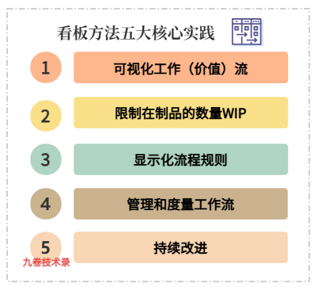
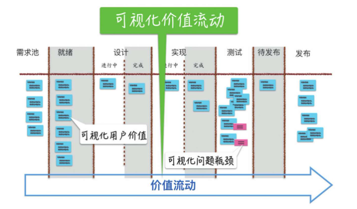
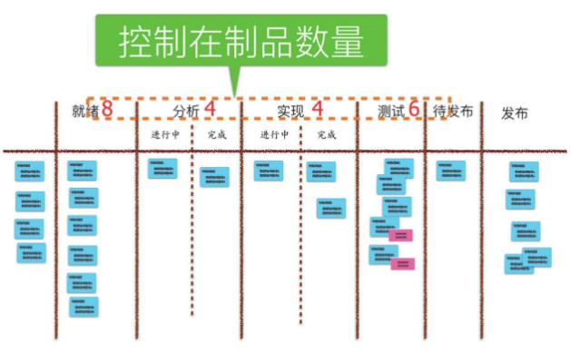
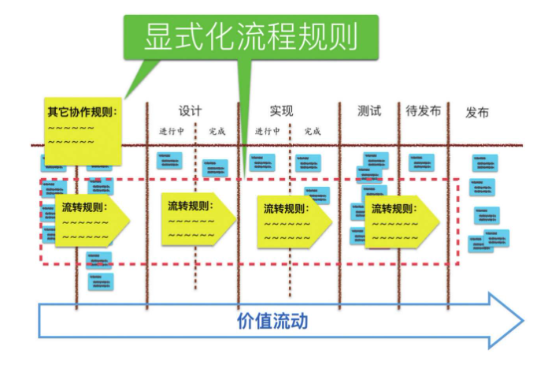
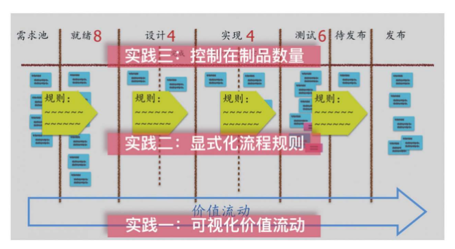
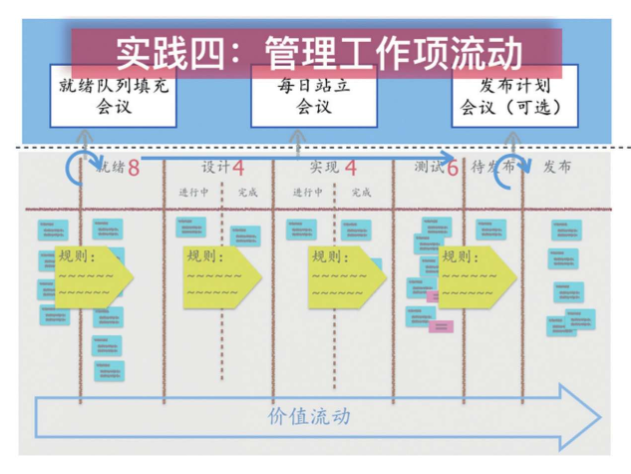
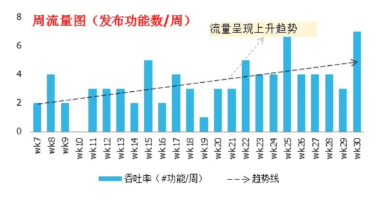
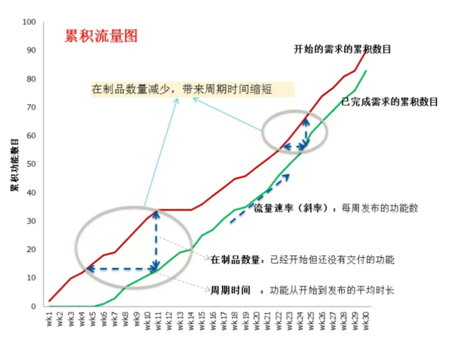

## 前言

明确了价值定位并设计了最小可行产品（MVP）功能集，接下来就是要开发 MVP 产品，交付给市场进行验证。

精益产品开发中实现高效交付的核心实践方法——看板方法。看板方法（Kanban）源自丰田生产系统，是精益产品开发的核心实践之一。

看板方法是将“聚焦流动效率”这一核心理念落地的实践体系。通过可视化价值流动、控制在制品数量、显式化流程规则等一系列实践，看板方法帮助团队从让每个人忙起来的资源效率思维，转向让价值快起来的流动效率思维，实现顺畅地交付有用的价值。

## 价值流映射

实施看板方法的第一步是进行价值流映射（Value Stream Mapping），即绘制从需求提出到功能完成交付的完整流程图，然后识别其中的瓶颈和浪费。

价值流映射需要团队成员共同参与，对整个交付流程进行可视化审视。

开发常见的价值流阶段包括：

>  需求收集、需求分析、设计开发、代码评审、测试、部署、发布等。

在每个阶段，需要标注该阶段的处理时间（Processing Time）和等待时间（Wait Time），以及该阶段的在制品数量。通过价值流映射，团队可以清晰地看到价值流动的“堵塞点”——那些处理时间长、等待时间长、或者在制品积压严重的环节。这些瓶颈正是改进的重点方向。

## 拉动式生产

看板方法的有一个核心理念是**拉动式生产**。与传统开发模式中上游推动任务给下游不同，拉动式生产强调：下游根据自身容量，从上游拉取任务。

推动式管理的典型场景是：产品经理将一堆需求扔给开发团队，开发团队做完后再扔给测试团队。结果往往是测试队列堆积如山，开发人员却已经开始新的任务。

拉动式管理的逻辑是：只有当下游（如测试）有容量时，才从上游（如开发）拉取新的任务。这种机制强制团队关注“完成”而非“开始”，避免了在制品的无序堆积。

## 看板方法的五大核心实践

软件产品是一种虚拟产品，在软件产品开发中，软件开发的工作（需求、编写代码、测试代码等）一般普通人是看不见的，除非是一个软件成品。那更不要说它的多个工作步骤可以被看见。为了使软件产品开发变成有步骤、可视化，使开发更有效率，从精益制造中借鉴了看板kanban管理方法。

看板方法是建立在五大核心实践之上，它们共同构成了一个完整的实践体系。

### 实践一：可视化价值流动

可视化是看板方法最基础、最核心的实践。它的目标是将抽象的脑力劳动转化为看得见的卡片和流程，让价值流动变得透明、可视化。

（来自：精益产品开发一书，作者：何勉）

上图展示了一个产品开发，端到端的流程步骤，也就是产品价值交付的整个过程。通过这张图不仅可以看见用户价值，也可以看见工作流程中的瓶颈问题，也就是及时发现瓶颈并解决。

#### 如何可视化价值流

**第一步：定义工作流（映射价值流）**

不要完全照搬别人的模板，可以适当借鉴，然后根据团队真实的研发场景来设定流程的列。一个典型的产品研发看板可能包含以下的列：

| 流程阶段 | 说明                                 |
| :------- | :----------------------------------- |
| 待办事项 | 经过初步筛选的需求，等待进入开发流程 |
| 需求分析 | 正在进行分析和细化的需求             |
| 原型设计 | 正在进行交互和视觉设计               |
| 开发中   | 正在进行编码实现                     |
| 测试/QA  | 正在进行功能测试和验证               |
| 验收     | 产品负责人进行验收                   |
| 已发布   | 已上线交付用户                       |

**第二步：任务拆解与卡片化**

将大的需求或功能拆解在合理时间内（如2-3天）可完成的颗粒度任务。每个任务就是一张卡片，卡片上应包含关键信息：

- 需求描述
- 优先级
- 负责人
- 截止日期
- 关联的文档或链接

**第三步：全员共享同一视图**

看板是团队的单一事实来源（SSOT）。

所有利益相关者——产品、设计、开发、测试、管理者——看着同一张图说话，减少了信息传递中的误解。无论是物理看板墙还是数字化看板工具，关键在于每个人都能够随时了解当前的工作状态。

可视化带来的直接收益是：谁在做什么，卡在哪里，一目了然。

瓶颈在哪里被暴露，问题在哪里发生，都变得清晰可见。

### 实践二：控制在制品数量WIP

控制在制品（Work In Progress, WIP）数量是看板方法的精髓，也是实现从资源效率向流动效率转变的关键。

（来自：精益产品开发一书，作者：何勉）

**什么是 WIP 限制？**

WIP 限制是指为看板上的每个阶段（列）设定一个并行任务数量的上限。

例如，开发中列最多只能有3张卡片，测试中列最多只能有 2 张卡片。

**为什么 WIP 限制如此重要？**

《精益产品开发》一书中用来一个生动的比喻来解释 WIP 限制的原理。在水利工程中，通过收窄河道，可以增加水流速度，冲走淤积的泥沙。同样，通过限制在制品数量（收窄河道），可以加速价值流动（增加流速），暴露并冲走系统中的问题（冲走淤积）。

**WIP 限制带来的直接收益**：

1. 加速价值流动：限制并行任务数量，意味着团队必须优先完成手头任务才能开始新任务，从而缩短单个任务的周期时间。
2. 减少上下文切换：多任务并行导致频繁的上下文切换，每次切换都会带来效率损耗。WIP 限制让团队聚焦，减少这种损耗。
3. 暴露瓶颈：当某个阶段堆积的任务达到 WIP 上限时，这个阶段就成为系统的瓶颈。团队必须协作解决瓶颈问题，否则无法推进新任务。
4. 提高质量：任务数量减少，团队有更多精力关注质量，减少返工。

**如何设定WIP限制？**

WIP限制的设定需要遵循以下原则：

- 初始值参考团队历史吞吐量：例如，观察过去团队平均同时处理几个需求，以此作为初始WIP值。
- 不同类型任务差异化设置：紧急缺陷可单独开辟通道，设置较低的WIP限制。
- 定期评审调整：WIP限制不是一成不变的，需要根据团队实际表现定期优化。

**突破WIP限制时如何处理？**

突破 WIP 限制需触发阻塞信号。常见做法是用红色标记超限卡片，或在站会中专项讨论。

例如，当“待部署”列突破设定的 WIP=3 时，团队需优先协调测试环境和发布资源，而非继续推进新功能开发。这种机制将隐性问题显性化，避免进度数据失真。数据显示，严格执行 WIP 限制的团队，其周期时间波动范围能缩小 40% 以上。

### 实践三：显式化流程规则

可视化让流程变得透明，但仅有可视化还不够。团队需要共同定义并遵守明确的流程规则，消除沟通中的模糊地带。

（来自：精益产品开发一书，作者：何勉）

**流程规则包括哪些内容？**

**1. 各阶段的准入准出标准**

每个阶段都应该有明确的“进入条件”和“完成条件”。例如：

- 开发阶段准入：需求文档已评审通过、设计方案已确认
- 开发阶段准出：代码已完成、单元测试通过、代码审查完成

**2. 完成的定义（Definition of Done, DoD）**

每列（尤其是已完成）必须有可验证的完成标准。例如，代码完成的 DoD 可能包含：

- 单元测试覆盖率≥80%
- 通过代码质量扫描（如SonarQube）
- 更新了相关技术文档
- 通过了同行代码审查

明确的 DoD 能够消除进度统计中的水分。

**3. 优先级排序规则**

团队需要明确需求优先级如何确定，谁有权调整优先级，以及在什么情况下可以插队（如紧急缺陷）。

**4. 团队协作准则**

例如：每天站会前更新看板状态；任务受阻时及时添加阻塞标记；谁发现问题谁负责记录等。

显式化流程规则的价值在于：它让团队从靠默契工作转向靠规则协作，减少了沟通成本，提高了流程的可预测性。

### 上述3个实践建立看板系统

过以上三个实践，团队建立了看板墙和看板系统

（来自：精益产品开发一书，作者：何勉）

接下来看运作看板系统的2个实践。

### 实践四：管理价值、工作项流动

可视化、流程规则、WIP 限制共同构成了看板系统的基础框架，但系统本身不会自动运转。团队需要主动管理价值的流动、工作项的流动，确保持续、顺畅地交付价值。

（来自：精益产品开发一书，作者：何勉）

**管理价值流动的日常实践**：

**1. 每日站会：聚焦流动而非个人汇报**

每日站会应围绕看板展开，聚焦价值的流动情况，而非个人的工作汇报。高效站会的实践包括：

- 从左到右扫描看板：从最右侧的“已完成”开始，向左扫描，讨论阻碍流动的卡片。
- 关注停滞的任务：重点关注哪些任务卡在了某个阶段超过预期时间。
- 使用“移动次数”衡量进展：例如“昨天移动了2张卡至测试列”，而非“昨天我很忙”。
- 记录阻塞原因：用于后续改进分析。

某硬件团队在站会中统计“等待第三方响应”类阻塞占比达60%，后通过建立供应商SLA将此类延误减少75%。

**2. 就绪队列填充**

就绪队列是待办事项中已经准备好进入开发的需求集合。团队需要定期（如每周）召开就绪队列填充会议，从需求池中筛选出优先级最高、准备最充分的需求，放入就绪队列，等待开发团队拉取。这确保了开发团队始终有高质量的、优先级明确的工作可做。

**3. 发布规划**

基于看板数据（如平均周期时间、吞吐量），团队可以更准确地进行发布规划。例如，如果团队平均每周完成 5 个需求，当前就绪队列中有 20 个需求，那么大致可以预测下一个发布版本需要 4 周时间。

**4. 可视化阻塞和风险**

在看板上明确标记阻塞的任务（如用红色卡片或阻塞标签），让问题一目了然。团队需要建立机制，快速响应和处理阻塞。

通过持续的监控任务在流程中的移动效率，通过数据分析，比如开发周期时间、吞吐量、任务完成率（每天完成的任务）、阻塞的数量、每周发布的功能数量、在制品数量等度量指标来发现瓶颈，优化价值流动的效率。

还可以通过累积流量图来查看改进的方向。

### 实践五：建立反馈，持续改进

看板方法的最终目标是持续改进。它不是一次性搭建就完事的工具，而是需要不断迭代优化的流程系统。

**持续改进的机制**

**1. 定期回顾**

每周或每两周召开回顾会议，分析看板产生的数据，识别改进机会。回顾会议可以聚焦以下问题：

- 我们的周期时间是否有异常波动？
- 哪个阶段经常成为瓶颈？
- 阻塞的主要原因是什么？
- 我们的 WIP 限制是否合理？

**2. 基于数据的决策**

看板方法强调用数据驱动改进。常用的度量指标包括：

| 指标                   | 定义                                 | 用途                     |
| :--------------------- | :----------------------------------- | :----------------------- |
| 周期时间（Cycle Time） | 任务从“开始开发”到“完成”的时间       | 衡量交付速度             |
| 前置时间（Lead Time）  | 任务从“提出需求”到“完成交付”的总时间 | 衡量端到端响应能力       |
| 吞吐量（Throughput）   | 单位时间内完成的任务数量             | 衡量团队产能             |
| 流动效率               | 任务实际工作时间 / 总周期时间        | 衡量价值流动中的浪费程度 |

某物流团队通过控制图发现“海关申报”任务周期突然延长，排查后是政策变更导致，随即更新申报手册，恢复了正常周期。

**3. 实验性改进**

看板方法倡导“协作式改进，实验性进化”——使用模型和科学方法，将改进视为假设检验的过程。团队可以提出改进假设（例如如果我们增加自动化测试，测试阶段周期时间会减少20%），然后通过小范围实验验证，有效则推广，无效则调整。

**4. 分层度量与价值流映射**

除了日常的周期时间和吞吐量追踪，团队还应定期开展更深度的分析：

- 流动效率分析：通常暴露 30%-70% 的等待浪费。通过看板数据定位主要等待环节，可针对性引入自动化或并行处理。
- 价值流映射（VSM）：每季度对比当前看板流程与理想状态，识别改进机会。例如，某内容平台发现排版校对环节占整体时间的 40%，通过培训设计人员使用标准化模板，将该环节压缩 60%。

## 数字化看板

物理看板（墙面+便利贴）的优点是直观、低成本、促进面对面协作。但在远程协作和复杂项目管理中，数字化工具是必不可少的。

现代看板工具（如Jira、PingCode、Worktile等）提供了超越物理看板的强大功能：

**1. 高度自定义的工作流**
可以根据团队需求完全自定义列名和流程阶段，匹配特定的研发场景。

**2. 信息丰富的智能卡片**
自定义卡片字段，展示关键信息：开始/截止日期、优先级、关联任务、工时记录等。支持按负责人分组（查看谁在超负荷工作）或按优先级分组。

**3. 深度协作功能**
每个任务卡片都是一个独立的工作区，团队成员可以在卡片内评论、关联子任务、上传文档。可邀请客户进入特定工作区，对任务进行评论，实现异步且精准的反馈闭环。

**4. 自动化**

- 状态自动流转：设置规则，当开发人员填写工时或上传代码后，卡片自动从“开发中”移动到“测试中”。
- 智能分配：如果任务无人认领或滞留过久，系统可自动提醒项目经理或分配给特定角色。

**5. 数据分析和预测**

- 累积流图（CFD）：清晰显示各状态任务数量随时间的变化趋势。如果“进行中”列持续变宽，说明任务开始多完成少，需立即干预。
- 预测性分析：根据历史周期时间预测下一版本交付日期。

**6. 与其他工具的集成**
数字化看板可以与CI/CD工具、代码仓库、即时通讯工具集成，实现端到端的研发效能管理。

## 常见误区与避坑指南

### 误区一：看板就是贴纸条

**真相**：看板的核心是可视化、WIP 限制、拉动式管理等一套完整的方法论，而不仅仅是贴纸条。如果只是把任务从 Excel 搬到墙上，而没有 WIP 限制和拉动机制，那只是可视化任务板，而非真正的看板。

###  误区二：忽视WIP限制

**真相**：若团队长期无视 WIP 限制，看板将退化为普通任务板，失去防过载作用。WIP 限制是看板的精髓，必须严格执行。

### 误区三：过度装饰看板

**真相**：添加过多字段或颜色反而降低可读性，建议优先展示“负责人”“截止日”“优先级”等核心信息。

### 误区四：缺乏持续改进

**真相**：看板不是设好即忘的工具，需定期根据数据调整流程。如果搭建完看板就不再优化，看板的价值就无法充分发挥。

## 参考

- 《精益产品开发: 原则、方法与实施》 作者 ：何勉 https://book.douban.com/subject/27116921/
- 敏捷开发：什么是看板Kanban方法？看板方法介绍与使用 https://www.cnblogs.com/jiujuan/p/18690584
