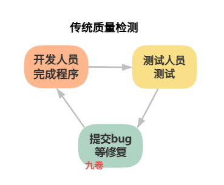

## 前言

在上一篇文章中，我们系统阐述了如何通过看板方法和拉动式开发流程，实现价值的高效交付。然而，交付速度的提升绝不能以牺牲质量为代价。低质量的产品会导致频繁的返工、生产停顿，以及客户信任的流失——这些都会彻底摧毁我们辛苦建立的流动效率。

本文将深入探讨精益产品开发中的质量理念与实践体系。从技术实践层面，详细阐述了测试驱动开发TDD、持续集成CI、持续部署CD等质量内建方法。这是内建质量的一个核心理念——质量必须内建于价值流动的每一个环节。

## 质量内建的理念：从事后检验到过程内建

### 传统质量观的困境

在传统软件开发模式中，质量往往被视为测试团队的责任。

典型的流程是：

1、 开发人员完成编码后，开发团队将开发完程序的产品交给测试团队；

2、测试团队测试，发现问题后，填写缺陷报告，提交bug工单，返回给开发团队修复；

3、修复后再测试，如此循环往复。

这种模式存在三个根本性问题：

**第一，质量是检出来的，而非做出来的**。

测试活动发生在流程末端，发现问题时已经产生了大量返工成本。质量不应该是事后检验的结果，而应该是全流程内建。

**第二，测试成为流程瓶颈**。

所有工作堆积在测试环节，导致价值流动停滞。

**第三，质量责任错位**。

当质量被视为测试团队的责任时，开发团队就失去了对质量的 ownership，导致我负责写代码，你负责找bug的割裂状态。

### 质量内建的核心思想

质量内建（Built-in Quality）源自精益思想，是精益产品开发的核心原则之一。它强调：

> 质量不是通过检验获得的，而是通过设计和过程构建出来的。

每一个工作环节都应该对自己的输出质量负责，确保向下游传递的是合格的产品。

质量改进的前提是：建立质量是构建出来的，而不是测试出来的共识。这意味着：

- 开发人员也要对质量负责：不仅仅是完成功能编码，还要确保代码的正确性、可测试性和可维护性
- 测试人员的角色转变：从找bug的人转变为质量教练和测试自动化专家，帮助开发团队构建测试能力
- 质量活动左移：将质量活动从流程末端向左移动，融入需求分析、设计、编码等早期环节

### 质量内建与流动效率的协同

有些人担心质量内建会拖慢交付速度。这种担忧源于对质量与速度关系的误解。实际上，质量内建是加速价值流动的前提条件。

试想两个开发团队：

团队 A 追求速度，快速编码后交给测试，发现 bug 再修复，一个需求可能往返多次；

团队 B 在编码过程中同步编写测试、进行代码审查，确保提交时质量较高。

从单个需求的开发时间看，团队 A 可能更快；但从端到端交付周期看，团队 B 往往胜出——因为避免了返工带来的等待和中断。

## 技术实践：将质量内建于开发流程

质量内建不是一句口号，而是需要通过一系列技术实践来落地。下面介绍三个实践方法：测试驱动开发、持续集成和持续部署。

### TDD测试驱动开发

测试驱动开发（Test-Driven Development, TDD）是一种将测试置于编码之前的开发方法。它的基本循环是“红-绿-重构”：

1. 红：编写一个失败的测试用例。这个测试定义了新功能的行为预期。
2. 绿：编写恰好能让测试通过的最简代码，不追求完美设计。
3. 重构：在测试的保护下，优化代码结构，消除重复，提升可读性。

**TDD的实施挑战与应对**：

TDD 对开发人员的思维方式有较高要求，初学者常常感到困难。团队可以采取渐进策略：

- 从核心模块开始尝试，而非全盘推行
- 结对编程，让有经验的成员带动新手
- 接受“先写测试”的原则，但允许在复杂场景下先做少量设计探索

### CI 持续集成

持续集成（Continuous Integration, CI）是指开发人员频繁地将代码变更合并到主干分支，每次合并都触发自动化构建和测试过程。其核心原则是：每天至少集成一次，每次集成都经过自动化验证。

**持续集成的实践要点**：

1. 频繁提交代码：避免长时间在本地开发，导致集成时出现大规模冲突
2. 自动化构建：每次提交后自动编译代码，确保没有语法错误和依赖问题
3. 自动化测试：运行单元测试和集成测试，确保新代码不破坏既有功能
4. 快速反馈：构建和测试过程应在 10 分钟内完成，让开发人员能及时响应
5. 保持主干健康：如果构建失败，团队应优先修复，而非提交新代码

**持续集成的价值**：

- 及早发现集成问题：传统模式在集成阶段才发现冲突，此时修复成本已高；持续集成让问题在出现时就被发现
- 减少等待时间：无需等待集成阶段，随时都可以发布可工作的软件
- 提升代码可见性：频繁集成促使团队成员关注彼此的工作，减少黑箱开发
- 建立质量信心：持续通过的构建，让团队对代码质量有持续的信心

### CD 持续部署

持续部署（Continuous Deployment, CD）是指在持续集成的基础上，将通过自动化测试的代码自动部署到生产环境。它让发布成为一个常态化、低风险的活动。

**持续部署与持续交付**：

需要区分两个相近概念：

- 持续交付：代码始终处于可部署状态，但是否部署到生产由业务决策
- 持续部署：每次代码通过自动化测试后，自动部署到生产

大多数团队从持续交付开始，逐步向持续部署演进。

**持续部署的技术前提**：

1. 高度自动化的测试：必须有一套覆盖全面的自动化测试，能够捕获绝大多数缺陷
2. 部署自动化：部署过程本身应该脚本化、自动化，减少人为错误
3. 特性开关：即使代码已部署，新功能可以通过特性开关控制是否对用户可见，实现部署与发布的解耦
4. 监控与回滚机制：部署后能够实时监控系统状态，发现问题能够快速回滚

**持续部署的价值**：

- 缩短价值交付周期：从“代码完成”到“用户可用”的时间大幅缩短
- 降低发布风险：小批量、频繁的发布，每次变更范围小，风险可控
- 减少发布压力：发布成为日常工作，而非“重大事件”
- 加速反馈循环：用户能更快用上新功能，团队能更快获得反馈

### 技术实践的协同效应

测试驱动开发、持续集成、持续部署不是孤立的实践，它们相互支撑，形成强大的协同效应：

- TDD为持续集成提供高质量的测试套件：没有测试，持续集成就只能验证代码能编译，无法验证功能是否正确
- 持续集成为持续部署提供质量保障：只有每次集成都经过验证，才能放心地自动部署
- 持续部署为TDD和持续集成提供反馈：部署到生产后，真实用户的使用数据又可以驱动新的测试用例和功能开发

这三者共同构成了精益产品开发的技术基础，让质量内建从理念变为现实。

## 多层次的反馈机制

质量内建不仅需要技术实践，还需要建立多层次的反馈机制，让团队能够及时获取质量信息并做出响应。

### 第一层：代码层面的反馈

代码层面的反馈是最基础、最快速的反馈环。它包括：

**单元测试反馈**：开发人员在编写代码后运行单元测试，几分钟内就能知道代码行为是否符合预期。这是最快速的反馈环，能够在问题“走出开发者机器”之前就被捕获。

**代码审查反馈**：同行对代码进行审查，提出改进建议。代码审查不仅能发现潜在缺陷，还能促进知识共享和质量文化建设。

**静态代码分析**：通过 SonarQube 等工具自动分析代码质量，检测潜在 bug、安全漏洞、代码异味等。这些工具可以作为持续集成的一部分，自动运行并提供报告。

### 第二层：流程层面的反馈

流程层面的反馈关注价值流动的效率和质量，主要通过看板系统提供的可视化信息和度量指标实现。

**看板站会**：团队每日围绕看板站会，从左到右扫描价值流动，关注停滞的任务、阻塞的卡片、WIP限制的突破情况。这是关于顺畅程度的定性反馈。

**累积流图**（Cumulative Flow Diagram, CFD）：累积流图展示各状态任务数量随时间的变化趋势。如果“进行中”曲线持续变宽，说明任务开始多完成少，需立即干预；如果“已完成”曲线趋于平缓，说明吞吐量下降。

**控制图**：控制图展示每个任务的周期时间（从开始到完成的时间），帮助团队识别周期时间的异常波动，分析波动原因并采取改进措施。

**前置时间分布图**：展示不同任务的前置时间分布情况，帮助团队了解交付的稳定性和可预测性。

### 第三层：产品层面的反馈

产品层面的反馈关注用户对产品的真实体验和满意度，这是最接近价值的反馈。

**用户访谈**：与真实用户面对面交流，观察他们使用产品的方式，倾听他们的反馈。

monday.com 的工程团队分享了一个实践：他们将用户反馈直接发送到专用的 Slack 频道，让每个团队成员都能看到用户如何使用产品，什么对他们有效，什么无效。这个反馈渠道成为产品质量内建的新方式。

**可用性测试**：邀请目标用户使用原型或 MVP，观察他们的操作行为，发现可用性问题。

**调研与满意度调查**：通过问卷调查收集用户对产品的满意度评分、功能偏好、改进建议等。调研可以作为定性访谈的补充，获取更大样本的数据。

### 第四层：业务层面的反馈

业务层面的反馈关注产品对业务目标的实际贡献，这是最宏观、最长期的反馈。

**关键指标分析**：基于产品类型和商业模式，定义并追踪关键指标。对于订阅型产品，关注留存率、客户生命周期价值；对于交易型产品，关注转化率、客单价；对于广告型产品，关注活跃用户数、用户时长。

**组群分析**（Cohort Analysis）：将用户按首次使用时间分组，追踪各组在不同时间段的留存率。组群分析能够揭示产品迭代对用户行为的真实影响。

**A/B测试**：通过对比实验，验证产品变更对用户行为的因果影响。A/B测试是用分析技术优化产品的重要工具，但它不能替代定性洞察——两者需要结合使用。

## 持续改进的机制

反馈本身不会带来改进，只有将反馈转化为行动，才能实现真正的提升。这需要建立持续改进的机制和文化。

### 回顾会议：定期的改进

回顾会议（Retrospective）是团队定期（通常每两周或每月）召开的改进会议，旨在反思过去一段时间的表现，找出改进机会，制定行动计划。

**回顾会议的结构**：

1. **准备数据**：收集过去一段时间的度量数据——周期时间、吞吐量、缺陷率、用户反馈等
2. **收集观察**：团队成员分享自己的观察和感受，可以使用“开始-停止-继续”框架
   - 开始做什么（新的实践）
   - 停止做什么（无效的活动）
   - 继续做什么（有效的实践）
3. **分析根因**：对重要问题深入分析，找到根本原因，而非停留在表面现象
4. **制定行动**：确定 1-3 个改进行动，明确负责人和完成时间
5. **跟踪落实**：在下一次回顾会议中回顾行动的完成情况和效果

### 基于数据的决策改进

持续改进需要基于数据，而非直觉或猜测。比如在看板方法中利用累积流图、控制图、前置时间分布图等定量工具，它们能够提供客观的事实依据。

**基于数据的改进实践**：

- 如果控制图显示周期时间持续变长，分析是哪个阶段成为瓶颈
- 如果累积流图显示测试中曲线持续变宽，考虑增加自动化测试或优化测试流程
- 如果前置时间分布图显示长尾任务增多，分析这些任务的共同特征，找出根本原因

### 实验性改进：小步快跑，快速验证

持续改进不是一刀切的大变革，而是小步快跑的实验性探索。

**实验性改进的步骤**：

1. 提出假设：基于观察和数据，提出改进假设。例如：“如果我们增加自动化测试，测试阶段周期时间会减少 20%”
2. 设计实验：设计小范围的实验来验证假设，例如选择某个模块先行试点
3. 运行实验：执行实验，收集数据
4. 评估结果：分析实验数据，判断假设是否成立
5. 决策推广：如果有效，扩大范围推广；如果无效，分析原因，调整假设

这种实验性改进降低了变革的风险，也让改进本身成为一个持续学习的过程。

### 文化塑造：让持续改进成为习惯

持续改进的最高境界，是将其融入团队文化，成为每个人的工作习惯。打造自组织质量团队，让团队具备自主发现问题、解决问题的能力。

**持续改进文化的特征**：

- 问题透明化：团队不隐藏问题，而是将问题视为改进机会
- 不指责个人，只改进系统：当问题发生时，**关注流程有什么缺陷，而非谁犯了错**
- **每个人都是改进的主人**：改进建议来自一线成员，而非仅由管理者下达
- 庆祝改进成果：对成功的改进给予认可和庆祝，强化改进的正向循环

## 质量内建的组织与工具支撑

### 团队角色的转变

质量内建要求团队角色重新定义：

**开发人员**：

从代码编写者转变为功能交付者，对质量负首要责任。需要掌握测试技能，参与自动化测试编写，主动进行代码审查。

**测试人员**：

从质量守门员转变为质量教练。他们的工作不再是找 bug，而是帮助团队建立测试能力，设计测试策略，构建自动化测试框架，辅导开发人员写出可测试的代码。

**产品负责人**：

参与验收测试，确保交付的功能真正满足用户需求。验收标准应该在开发开始前就明确，而非开发完成后才提出。

**敏捷教练/技术经理**：

建立质量文化，提供必要的工具和培训，消除阻碍质量的流程障碍。

### 跨职能协作

质量内建需要打破职能壁垒，建立跨职能协作机制。

**跨职能协作的实践**：

- 特性团队：组建包含产品、设计、开发、测试的跨职能团队，对特定特性端到端负责
- 结对编程实践：开发、测试、运维人员结对工作，共同解决问题
- 质量门禁：在关键节点设置质量门禁，需要跨职能团队共同评审通过才能进入下一阶段

### 工具链的支撑

质量内建离不开工具链的支撑。现代 DevOps 工具链能够将质量实践自动化、集成化。

**典型的 DevOps 实施工具链**：

- 代码质量管理：SonarQube、ESLint
- 单元测试框架：JUnit、pytest、Jest
- 集成测试工具：Selenium、Cypress
- 持续集成服务器：Jenkins、GitLab CI、GitHub Actions
- 部署自动化：Ansible、Terraform、Kubernetes
- 监控与告警：Prometheus、Grafana、Datadog

## 小结

这一篇文章系统阐述了精益产品开发中的质量理念与实践体系。总结为以下五点：

**第一，核心理念：质量内建**。

质量不是测试阶段检出来的，而是开发过程做出来的。每一个工作环节都应该对自己的输出质量负责，确保向下游传递的是合格的产品。质量内建与流动效率相互协同——没有质量，顺畅无从谈起；没有顺畅，质量成本高不可攀。

**第二，技术实践：三驾马车**。

测试驱动开发（TDD）、持续集成（CI）、持续部署（CD）是质量内建的三大技术支柱。TDD让测试驱动设计，持续集成让问题及早发现，持续部署让价值快速交付。三者相互支撑，形成强大的协同效应。

**第三，反馈机制：四层闭环**。

从代码层面、流程层面、产品层面到业务层面，建立多层次的反馈环，让团队能够及时获取质量信息并做出响应。代码反馈确保做对了，流程反馈确保做得快，产品反馈确保做的东西有人用，业务反馈确保用的人产生价值。

**第四，改进机制：从反馈到行动**。

通过回顾会议、基于数据的决策、实验性改进等机制，将反馈转化为具体行动，实现持续优化。改进的最高境界是将其融入团队文化，成为每个人的工作习惯。

**第五，组织支撑：角色、协作与工具**。

质量内建要求团队角色重新定义——开发人员对质量负责，测试人员成为质量教练。跨职能协作打破职能壁垒，工具链将质量实践自动化、集成化。

**质量不是附加在流程上的额外活动，而是流程本身的内在属性**。当我们将质量内建于价值流动的每一个环节，当反馈机制驱动持续改进成为团队文化，我们就真正实现了从事后检验到过程内建的转变。

