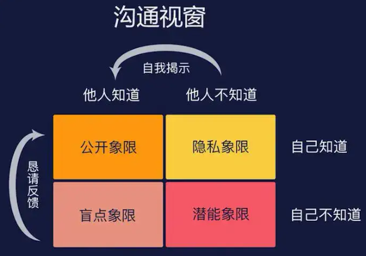
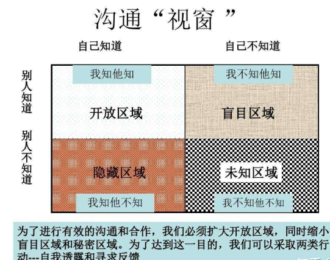
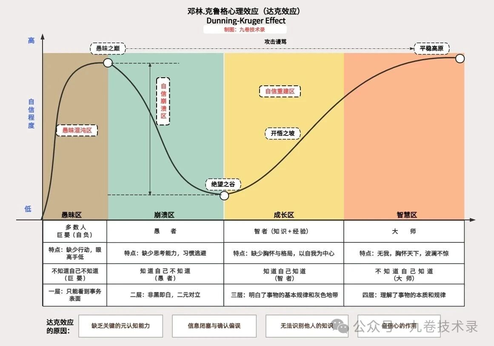
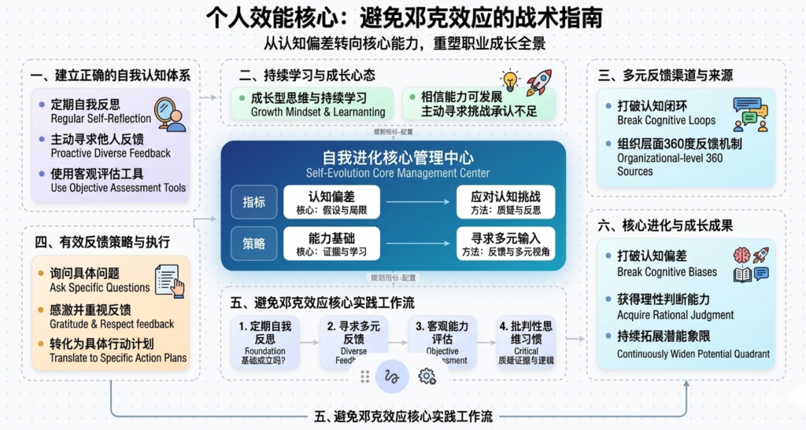
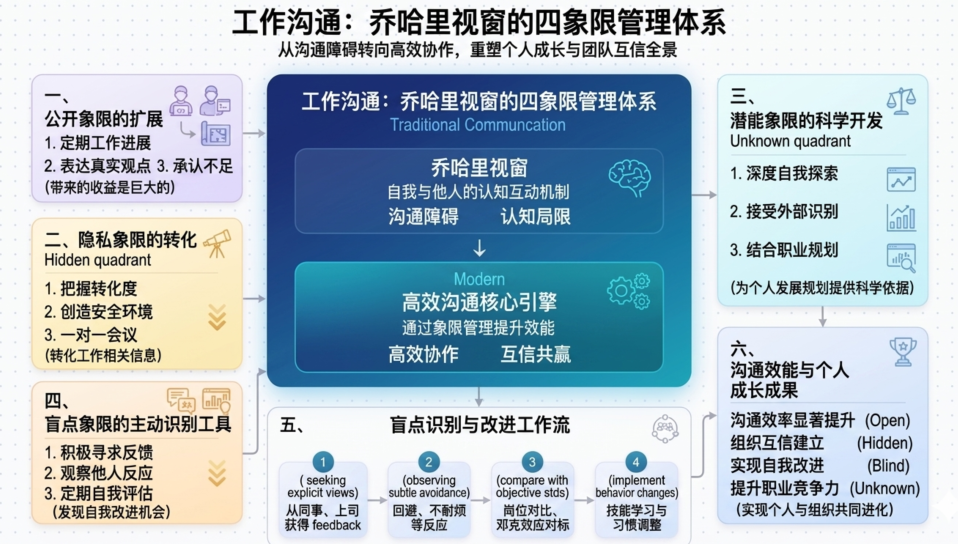
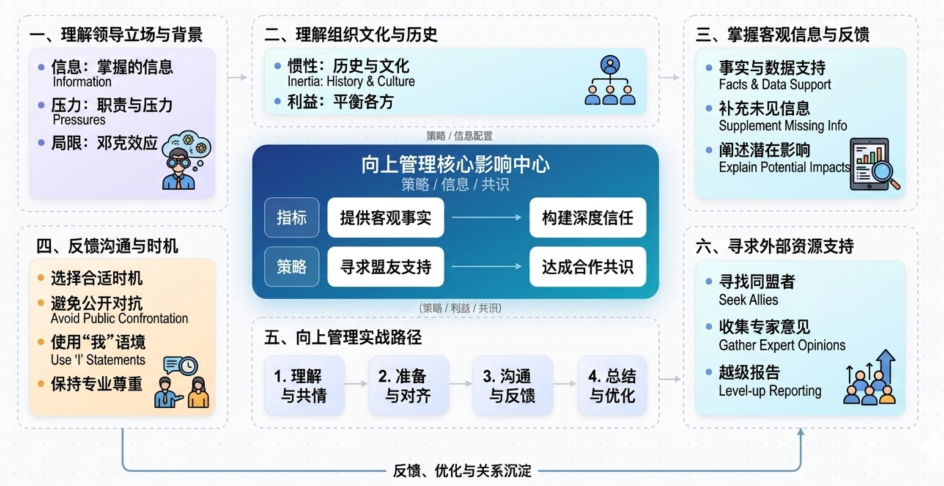
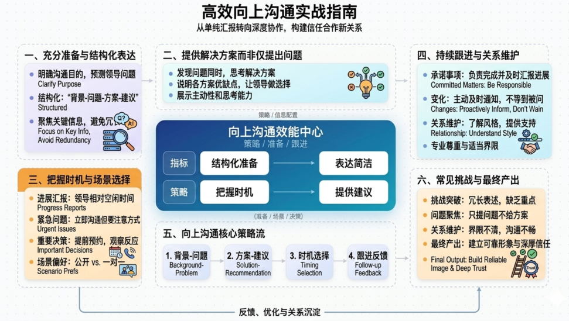

职场沟通中的认知盲点与突破之道：以沟通视窗和邓克效应为核心的深度分析

## 一、沟通视窗与邓克效应的理论基础

在现代职场环境中，有效沟通是推动工作进展、实现组织目标的关键要素。然而，我们常常发现，尽管每个人都认为自己具备良好的沟通能力，但实际工作中却频繁出现误解、冲突和效率低下的现象。这一现象的根源在于我们对自身认知的局限性缺乏足够的理解。

为了深入剖析职场沟通的本质问题，我们需要引入两个重要的心理学框架：乔哈里沟通视窗（Johari Window）和邓宁-克鲁格效应（Dunning-Kruger Effect）。

乔哈里沟通视窗是由美国心理学家乔瑟夫·卢夫特（Joseph Luft）和哈里·英格拉姆（Harry Ingham）于1955年提出的沟通模型。

该模型根据“自己知道-自己不知道”和“他人知道-他人不知道”这两个维度，将人际沟通中的信息划分为四个象限：

- 公开象限（Open Arena）、隐私象限（Hidden Facade）、盲点象限（Blind Spot）和潜能象限（Unknown Potential）。

​                                      （图片来自：https://zhuanlan.zhihu.com/p/108463120）

在职场中，每个人的信息都如同一扇窗子，通过与同事、领导的相互交流，这四个象限会不断发生变化，从而影响沟通效果和团队协作。

​                                                      (图片来自：https://zhuanlan.zhihu.com/p/465833645)

邓宁-克鲁格效应，简称邓克效应，是一种认知偏差现象，指的是能力欠缺的人往往高估自己的能力水平，产生虚幻的自我优越感。

这一效应由心理学家大卫·邓宁（David Dunning）和贾斯汀·克鲁格（Justin Kruger）于1999年首次提出。他们通过一系列实验发现，那些在特定领域表现不佳的人，往往无法正确评估自己的真实水平，反而倾向于认为自己比实际表现更为优秀。这一现象在职场中极为常见，也是导致沟通障碍和决策失误的重要心理因素。

(图片来自：https://mp.weixin.qq.com/s/VTqc3agQmDwIZw6yCZrPaw)

将这两个理论框架结合在一起，我们可以更系统地理解职场沟通中存在的深层问题，并据此提出更具针对性的改进策略。

## 二、职场沟通中的四大盲点与邓克效应表现

### 2.1 公开象限：过度自信与信息不对称

公开象限是指那些自己知道、他人也知道的信息区域。在职场中，这包括个人的工作能力、性格特点、工作风格以及已知的工作进展状况等。理想状态下，公开象限应该尽可能扩大，因为透明度越高，沟通成本越低，协作效率也就越高。

然而，邓克效应在公开象限中表现为一种常见的陷阱：人们往往高估自己的专业能力和贡献度。

在项目团队中，这种现象尤为明显。一个认为自己“无所不能”的同事，可能会在会议中过度强调自己的想法，忽视他人的意见和建议。他们坚信自己的方案是最佳的，因此不愿意接受批评或建议。这种过度自信不仅会导致个人职业发展的停滞，更会阻碍团队的整体进步。当公开象限中的自我认知与他人认知存在巨大差距时，沟通就会变得困难重重。

例如，一位项目经理可能认为自己具有良好的领导力，但团队成员却觉得他独断专行，这种认知差距就是公开象限中的盲点。

### 2.2 隐私象限：信息隐藏与沟通障碍

隐私象限是指自己知道但他人不知道的信息。在职场中，这包括个人的真实想法、未表达的观点、私人问题以及对某些决策的保留意见等。隐私象限的存在是正常的，因为每个人都需要一定的私人空间。然而，当隐私象限过大时，就会产生严重的沟通问题。

邓克效应在隐私象限中的表现尤为隐蔽。许多人由于过度自信，不愿意向他人透露自己的真实想法，因为他们认为自己的想法是正确的，不需要他人的认可或建议。这种心态导致信息闭塞，团队成员之间缺乏必要的了解。

例如，一位员工可能对领导的某个决策持反对意见，但由于认为自己的观点更高明，或者担心表达不同意见会影响自己的职业发展，于是选择保持沉默。这种隐藏真实想法的行为，最终可能导致决策失误或执行困难。

更危险的是，隐私象限中还包含“自己不知道”的信息，这就是所谓的“潜意识盲区”。

例如，一个人可能根本没有意识到自己的沟通方式存在问题，或者没有察觉到自己在团队合作中的负面作用。这些潜意识中的缺陷，由于不在个人的自我认知范围内，往往被忽视，直到问题爆发才被发现。

### 2.3 盲点象限：认知盲区的危害

盲点象限是指他人知道但自己不知道的信息。这是沟通视窗中最具潜在危害的区域，因为这些信息对个人成长和改进至关重要，但往往最难被察觉。

在职场中，盲点象限可能包括个人的性格缺陷、工作方法的不足、沟通方式的令人不悦之处等。

邓克效应与盲点象限有着密切的关联。

之所以存在盲点象限，正是因为邓克效应的作用：能力或认知水平较低的人，往往无法意识到自己的不足。这种“不知道自己不知道”的状态，是职场发展最大的障碍之一。

一个刚入职场的年轻人，可能由于缺乏经验而无法正确评估自己的工作效率；一个在管理层工作多年的领导，可能由于长期处于权力中心而无法察觉自己的决策方式存在的问题。

盲点象限的危害在于，如果不及时发现和处理，这些潜在的缺陷可能会逐渐放大，最终导致严重的后果。在团队协作中，如果某个成员的盲点象限过大，其他成员可能会被迫承担额外的工作负担，或者因为无法忍受其沟通方式而产生冲突。

在项目管理中，如果负责人的盲点象限包含关键的决策失误，整个项目可能会走向失败。

### 2.4 潜能象限：被忽视的成长空间

潜能象限是指自己和他人都不知道的信息区域，代表着个人的潜力和尚未开发的领域。

在职场中，这可能包括未被发掘的天赋、尚未学习的新技能、潜在的职业发展方向等。虽然潜能象限相对抽象，但它对个人和组织的长期发展具有重要意义。

邓克效应在潜能象限中的表现是，人们往往低估自己的潜力，或者根本没有意识到自己还有提升的空间。这种认知偏差导致个人画地为牢，不愿意尝试新的挑战或学习新的技能。在职场中，许多人满足于现状，认为自己已经达到了能力的天花板，因此拒绝接受新的任务或挑战。实际上，每个人的潜能都是巨大的，只有通过不断的实践和学习，才能逐渐开发这些潜在的能力。

从团队角度来看，潜能象限的忽视也是一种资源浪费。如果管理者没有意识到团队成员的潜在能力，就可能无法合理分配工作任务，导致人才浪费或工作分配不当。同样，如果员工自己没有意识到自身的潜能，就可能错失职业发展的良机。

## 三、邓克效应在职场中的具体表现形态

### 3.1 能力欠缺者的虚幻优越感

邓克效应最核心的表现是能力欠缺者往往高估自己的能力。

在职场中，这种现象非常普遍。

一个刚完成基础培训的新员工，可能会认为自己已经掌握了岗位所需的所有技能；一个只经历过一两个项目的员工，可能会认为自己已经具备了项目管理的能力；一个在某个领域略有涉猎的人，可能会认为自己是该领域的专家。

这种虚幻的优越感会导致一系列不良后果。首先，它会阻止个人寻求进一步的学习和发展机会。既然认为自己已经足够优秀，那么参加培训、寻求指导就变得没有必要。其次，它会导致对他人意见的轻视。当一个人认为自己比周围人都更优秀时，他就很难听取同事或下属的建议，更不用说主动请教了。

最后，它会造成决策失误。由于缺乏对自身能力的正确认识，人们可能会承担超出自己能力范围的任务，最终导致工作质量下降或任务失败。

### 3.2 认识不足导致的固执己见

固执己见是邓克效应在职场中的另一重要表现。

当人们高估自己的能力时，他们也会相应地高估自己观点的正确性。这种认知偏差导致他们在面对不同意见时，倾向于坚持自己的立场，而不是客观地评估各种观点的优劣。

在团队会议中，这种固执己见的表现尤为明显。

持有错误观点的人往往最坚持自己的看法，因为他们根本没有意识到自己的认知存在偏差。相反，那些真正有能力的人，反而更容易承认自己的不足，愿意听取他人的意见。这就是为什么在某些会议中，最有声量的往往不是最正确的，而真正有见地的意见却被淹没在噪音中。

固执己见在职场中的危害是多方面的。

它会导致团队决策质量的下降，因为错误的观点被坚持执行；它会造成团队内部的冲突，因为不同意见无法得到妥善处理；它会阻碍创新，因为新的想法被认为是不正确的而被拒绝。

### 3.3 自我认知偏差

邓克效应导致的自我认知偏差不仅仅表现为能力的过度自信，还包括多个层面的认知问题。

首先是知识偏差：人们往往高估自己对某项知识或技能的理解程度。一个阅读过几本专业书籍的人，可能会认为自己已经掌握了该领域的核心知识，而实际上他可能只了解一些表面的概念。

其次是经验偏差：人们倾向于将偶然的成功归因于自己的能力，而将失败归因于外部因素。这种归因偏差在职场中非常普遍，它会导致人们无法从失败中吸取教训，也无法正确评估自己的实际能力。

第三是反馈偏差：人们往往选择性地接收支持自己观点的信息，而忽视或排斥与自己观点相悖的证据。在职场中，这意味着一个固执己见的人会只关注赞同自己意见的反馈，而忽视那些指出问题的意见。

最后是比较偏差：人们往往选择那些不如自己的人进行比较，从而获得虚假的优越感。在职场中，这种比较偏差让人无法看到更优秀同事的能力，也无法找到自己改进的方向。

## 四、避免邓克效应策略

避免邓宁克鲁格效应的一些应对策略：

（图片由AI生成）

### 4.1 建立正确的自我认知体系

避免邓克效应的第一步是建立正确的自我认知。这需要我们意识到自己认知的局限性，并主动寻求方法来校正这种偏差。

首先，个人应该定期进行自我反思，审视自己的工作中的表现和决策，找出可能存在的不足之处。这种反思应该是诚实的、批判性的，不能带有自我保护的心理。

其次，个人应该主动寻求他人的反馈。在职场中，向上司、同事和下属寻求反馈是了解自己盲点的重要途径。但是，寻求反馈需要创造一个安全的环境，让他人愿意说出真实的看法。这可能需要领导者带头示范，展示对反馈的开放态度。

第三，个人可以通过客观的评估工具来了解自己的能力水平。例如，通过完成标准化的测试、参与公开的竞赛或项目、比较自己在行业中的位置等方式，获得更客观的能力评估。这些外部的评估结果可以帮助校正内部自我认知的偏差。

最后，建立成长型思维模式至关重要。邓克效应之所以能产生影响，是因为固定型思维模式让人认为能力是天生的、不可改变的。成长型思维模式则让人相信能力是可以通过努力和学习来发展的，这种信念会促使人们主动寻求反馈、承认不足并持续改进。

### 4.2 寻求多元反馈渠道

要打破邓克效应造成的认知闭环，积极寻求多元化的反馈渠道是关键。

在职场中，反馈来源应该包括上司、同事、下属、客户以及其他利益相关者。每个群体提供的反馈视角都是不同的：上司可能关注战略思维和执行能力，同事可能评价团队协作和沟通能力，下属可能感受领导风格和决策方式，客户可能评价服务态度和专业水平。

为了获得真实的反馈，个人需要采取几个策略。

- 第一是主动询问具体的问题，而不是泛泛地问“你对我的工作有什么建议”。例如，可以问“在我的上次报告中，你认为哪些部分的论证不够充分？”这样的具体问题更容易获得有价值的反馈。

- 第二是对反馈表示感激和重视，即使你不同意某条反馈，也应该感谢对方的坦诚。

- 第三是将反馈转化为具体的改进行动，制定明确的计划来改进被指出的问题。

在组织层面，建立系统性的反馈机制也非常重要。这可能包括定期的绩效评估、360度反馈、同事互评等制度。这些机制可以为员工提供更全面、更客观的反馈信息，帮助他们了解自己的盲点象限。

### 4.3 持续学习与谦逊心态

持续学习是避免邓克效应的根本途径。职场环境在不断变化，新的技术、方法和理念层出不穷。如果停止学习，曾经的专业知识可能会变得过时，曾经的能力优势可能会消失。因此，保持学习的习惯和谦逊的心态非常重要。

谦逊并不意味着自卑或缺乏自信，而是对自己的能力有清醒的认识，承认自己还有不足之处，愿意向他人学习。一个谦逊的人会认为自己还有很多不知道的东西，因此会保持好奇心和学习热情。这种心态会促使他们主动寻求新知识、接受新挑战，从而不断扩大自己的潜能象限。

在实践中，持续学习和保持谦逊可以通过几种方式实现。首先是阅读和学习，不仅限于本专业的知识，还应该广泛涉猎其他领域，拓宽视野。其次是参加培训和研讨会，与同行交流，了解行业的最新发展。第三是寻找导师或教练，从经验丰富的人那里获得指导和建议。第四是承担挑战性的任务，在实践中学习，暴露自己的不足，然后加以改进。

### 4.4 建立批判性思维习惯

批判性思维是避免邓克效应的认知工具。

它帮助我们在接收信息时保持警觉，质疑假设，评估证据，从而做出更理性的判断。在职场中，批判性思维可以帮助我们识别那些看似有道理但实际上存在问题的观点，也可以帮助我们发现自己思维中的漏洞和偏差。

培养批判性思维习惯需要几个方面的努力。

- 第一是质疑自己的假设。我们的大脑倾向于接受支持现有信念的信息，忽视或排斥相悖的证据。因此，有意识地质疑自己的假设是很重要的。在做出重要决策之前，应该问自己：我基于什么假设？这个假设成立吗？有没有其他可能的解释？

- 第二是寻求反面证据。当我们倾向于某个观点时，应该主动寻找反对这个观点的证据。这种“故意唱反调”的方法可以帮助我们发现思维中的盲点，避免盲目坚持错误的观点。

- 第三是逻辑推理训练。许多认知偏差源于不正确的逻辑推理。通过学习逻辑推理的基本原则，可以提高我们识别逻辑错误的能力，从而避免被错误的论证所误导。

- 第四是多元视角思考。在面对问题时，有意识地尝试从不同的立场和角度来思考。这可以帮助我们看到自己视角的局限性，获得更全面的认识。

## 五、有效职场沟通的策略

利用乔哈里窗理论进行有效职场沟通策略：

（图片由AI生成）

### 5.1 公开象限的扩展与透明化

有效职场沟通的基础是扩大公开象限。当个人愿意将自己知道的信息与他人分享时，沟通的效率和质量都会显著提高。扩展公开象限需要勇气和诚意，但带来的收益是巨大的。

在工作场景中，扩展公开象限可以采取几种方式。

- 首先是定期分享工作进展。主动向上司和同事汇报自己的工作进展，不仅可以让他人了解自己的工作状态，还可以及时获得反馈和指导。

- 其次是表达真实的想法和观点。在会议讨论中，愿意说出自己的真实想法，即使这些想法与主流观点不同。这种透明性可以帮助团队获得更多的视角，做出更好的决策。

- 第三是承认自己的不足。公开承认自己在某些方面的不足，不仅不会损害形象，反而会获得他人的尊重和信任。

对于团队和组织而言，建立透明的文化氛围非常重要。这包括信息的公开共享、决策过程的透明化、反馈渠道的畅通等。当组织文化鼓励透明和开放时，员工的公开象限自然会扩大，沟通效率也会随之提升。

### 5.2 隐私象限的适当转化

隐私象限不能完全消除，因为每个人都需要一定的私人空间。但是，过大的隐私象限会导致沟通问题。因此，适当转化隐私象限，将其转化为公开象限，是提高沟通效果的重要策略。

在职场中，转化隐私象限需要把握好度。

一些私人信息，如个人生活问题，不一定需要与同事分享。但是，与工作相关的信息，如对某项决策的真实看法、工作中遇到的困难、对团队合作的建议等，应该尽可能地分享出来。

转化的关键在于创造安全的沟通环境。当员工相信表达不同意见不会受到惩罚或嘲笑时，他们会更愿意分享自己的想法。这需要领导者展示开放的态度，容忍不同的声音，并对提出建设性意见的员工表示赞赏。

另一个转化隐私象限的方法是通过一对一沟通。在私密的环境中，人们更容易说出在公开会议上不会说的话。定期的一对一会议可以成为转化隐私象限的有效渠道。

### 5.3 盲点象限的主动识别

盲点象限是自我改进最重要的信息来源，因为它们揭示了我们自己看不到的不足。主动识别盲点象限是个人成长和沟通改进的关键。

识别盲点象限需要借助他人的帮助。正如前面所讨论的，积极寻求反馈是发现盲点的主要途径。除此之外，还可以通过观察他人的反应来推断自己的盲点。当同事在某些话题上回避与你交流时，当下属在会议中显得不耐烦时，这些反应可能暗示着你的某些行为或沟通方式存在问题。

定期进行自我评估也是识别盲点的方法。虽然自我评估可能受到邓克效应的影响，但通过与客观标准的比较，仍然可以发现一些明显的差距。例如，可以通过与行业最佳实践的比较、与岗位要求的对比等方式，找出自己的不足之处。

一旦识别出盲点，下一步就是采取行动来改进。这可能需要改变某些行为习惯、学习新的技能，或者调整自己的沟通方式。重要的是要保持开放的心态，将盲点视为改进的机会，而不是对自我价值的威胁。

### 5.4 潜能象限的科学开发

潜能象限代表着个人尚未开发的潜力。有效地开发这些潜能，不仅可以提升个人的职业竞争力，也可以为组织创造更大的价值。

开发潜能象限需要几个条件的配合。

- 首先是自我探索。个人需要花时间思考自己的兴趣所在、擅长的领域、以及可能的发展方向。这可能需要通过尝试不同的工作任务、参与不同的项目来实现。

- 其次是外部识别。他人的观察和反馈可以帮助发现个人自己没有意识到的潜能。

管理者和同事可能会看到个人身上的潜在优势，这些视角对于潜能的开发非常宝贵。

在职场中，潜能的开发应该与职业发展规划相结合。组织应该为员工提供尝试新事物、承担新挑战的机会，帮助他们发现和发展自己的潜能。员工自己也应该主动寻求这些机会，不要画地为牢，满足于现状。

## 六、推动任务顺利进展的沟通技巧

### 6.1 明确目标与预期管理

任务推进顺利的首要条件是明确的目标和一致的预期。许多项目失败或延误的根源在于，参与各方对目标的理解不一致，或者对预期结果的认知存在差距。

在任务开始之前，应该进行充分沟通，确保所有相关方对以下问题有清晰的理解：

> 任务的具体目标是什么？成功的标准是什么？时间节点和里程碑是什么？各自的责任和角色是什么？需要哪些资源和支持？可能面临的风险和挑战是什么？

这种沟通不应该是一次性的，而应该是持续的过程。随着项目的进展，目标和预期可能需要调整。因此，定期的沟通和确认是必要的。当发现预期与实际存在差距时，应该及时沟通，协商解决方案。

在向上级汇报时，目标的明确性尤为重要。应该使用具体、可衡量的指标来描述目标，避免使用模糊的语言。例如，“提高客户满意度”不如“将客户满意度评分从85%提高到90%”来得明确。

### 6.2 积极倾听与表达技巧

积极倾听是有效沟通的核心技能之一。它不仅仅是听到对方说的话，更重要的是理解对方的意思、感受和需求。在职场中，积极倾听可以帮助避免误解，建立信任，获取更多信息。

积极倾听的技巧包括：

> 保持眼神接触，展现关注的态度；不要打断对方，让对方说完自己的想法；复述对方的要点，确认自己的理解是否正确；提出澄清性问题，确保理解准确；注意非语言信息，如表情、语气、姿势等；控制情绪，避免在情绪激动时做反应。

在表达方面，清晰、准确、有结构的表达同样重要。包括：

> 使用简洁明了的语言，避免模糊和歧义；按照逻辑顺序组织内容；使用具体的数据和例子支持观点；注意语气和态度，保持尊重和专业的氛围；在适当的时候使用视觉辅助，如图表、PPT等。

在团队会议中，掌握说话的分寸和时机也很重要。这包括：

> 尊重发言秩序，不要随意打断；在充分理解后再发表意见；发言要有建设性，提供解决方案而不是只提出问题；控制会议时间，避免冗长无效的讨论。

### 6.3 建设性冲突与共识达成

在职场中，冲突是不可避免的。不同的观点、利益和优先事项必然会导致分歧。关键不在于避免冲突，而在于如何处理冲突，使其成为建设性的力量。

建设性冲突的特征是：

- 对事不对人，聚焦于问题和解决方案；
- 各方都保持开放的心态，愿意听取不同的意见；
- 基于事实和逻辑进行讨论，而不是情绪化的争论；
- 目标是为了找到最佳的解决方案，而不是赢得辩论。

达成共识的技巧包括：寻找共同点，

- 确认各方都同意的基础；
- 识别核心问题，将讨论聚焦于关键的分歧点；
- 探索可选方案，头脑风暴出多种可能的解决方案；
- 评估利弊，客观分析每个方案的优缺点；
- 妥协与协调，在非核心问题上做出让步；
- 明确决定，当无法达成完全一致时，由有决定权的人做出最终决定。

在冲突中保持专业和尊重是非常重要的。应该避免人身攻击、讽刺挖苦、以及其他可能损害关系的行为。记住，冲突的目的是为了找到更好的解决方案，而不是证明谁是对的。

### 6.4 持续跟进与反馈循环

任务的顺利推进需要持续的沟通和跟进。这包括定期的进度汇报、问题的及时反馈、以及成果的确认和验收。

建立有效的跟进机制需要几个要素：

- 明确的时间节点和检查点；

- 定期的进度会议或报告；

- 问题升级的渠道和流程；

- 变更管理的程序。

  

当发现问题或偏离计划时，应该及时沟通，而不是等到最后一刻才报告。

反馈循环是持续改进的基础。这包括：

- 在任务执行过程中提供进展反馈；
- 在任务完成后提供结果反馈；
- 总结经验教训，为未来项目提供借鉴。
- 反馈应该是及时的、具体的、建设性的，既要指出问题，也要提供改进的建议。

在跟进过程中，保持积极的态度很重要。即使遇到困难和挫折，也应该保持乐观和专业的态度，向相关方传达信心和解决方案。同时，也要实事求是地报告问题，寻求必要的支持和资源。

## 七、面对有时候固执己见领导的应对智慧

面对一些有时候固执己见的领导的应对策略：

### 7.1 理解领导立场与决策背景

面对固执己见的领导，首先要做的不是对抗或抱怨，而是尝试理解他们的立场和决策背景。领导之所以坚持某个观点，可能有我们不知道的信息或考量。

理解领导立场需要从几个角度思考：

领导掌握的信息是什么？这些信息是否可能影响他们的判断？领导的职责和压力是什么？他们需要平衡哪些利益？组织的历史和文化对决策有什么影响？领导过去的经历是否影响了他们的观点？

通过换位思考，我们可以更好地理解领导的决策逻辑，也可能发现我们自己视角的局限性。这种理解不是为了盲目服从，而是为了更有效地沟通和影响。

同时，我们也应该认识到，领导也是人，也可能受到邓克效应的影响。他们可能由于经验或位置的局限性，无法看到某些问题。在这种情况下，我们的任务是找到合适的方式，帮助他们获得更全面的信息。

### 7.2 提供信息与反馈

当你认为领导的决定存在问题或可以改进时，提供信息和反馈是必要的。但要注意方式方法和时机。

提供信息时，应该注重客观性和相关性。使用事实和数据来支持你的观点，而不是情绪化的表达。提供的信息应该是领导之前可能没有考虑到的，或者是他们可能误解的。同时，要说明这些信息为什么重要，可能会产生什么影响。

选择合适的时机也很重要。避免在公共场合或领导情绪激动时提出反对意见。选择领导相对放松、愿意倾听的时候进行沟通。如果是比较复杂的问题，可以事先预约时间，给领导准备的机会。

在反馈时，要注意措辞和态度。使用第一人称表达自己的观点，如“我认为”、“我的担心是”，而不是“你错了”或“你必须改变”。即使你对领导的决定强烈不认同，也要保持尊重和专业。

记住，你的目标是影响领导做出更好的决策，而不是证明自己是对的。

### 7.3 寻求支持与资源整合

如果你无法单独说服领导，不要犹豫寻求其他支持。这可能包括寻找同盟者，收集更多的证据，或者借助其他资源。

寻找同盟者意味着找到那些同意你观点的同事，一起向领导表达意见。这种方式可以增加说服力，也显示了问题的普遍性。但是，要注意避免形成对抗性的“小团体”，否则可能会适得其反。

收集更多的证据可以增强你的说服力。这可能包括行业数据、案例研究、专家意见、员工反馈等。客观的证据可以帮助领导看到他们之前可能忽视的问题。

在某些情况下，可能需要借助正式的渠道，如更高级别的领导、人力资源部门、或其他相关方。但是，这是最后的手段，因为越级报告可能会损害你与直接领导的关系。

### 7.4 有效表达观点的策略

在向领导表达不同观点时，策略非常重要。以下是一些有效的表达技巧：

- 首先，从共同的目标出发。强调你们都希望达成好的结果，而不是强调分歧。可以说：“我们都希望这个项目成功，我有一些想法可能会帮助我们更好地达成目标。”

- 其次，提供选择而不是命令。不要说“你必须改变决定”，而是说“我认为有几个选项可能值得我们考虑”。这种方式保留了领导的面子，也更容易被接受。

- 第三，承认领导的观点有合理的部分。这显示了你的客观性和尊重。可以说：“我理解您考虑这个问题的角度，同时，我有一些不同的信息想分享。”

- 第四，强调风险和机会。可以说：“我担心如果按照目前的方案执行，可能会出现某种风险。或者，如果我们考虑另一个方案，可能会有某种机会。”

- 最后，提供后续的验证方式。可以说：“我们可以先在小范围内尝试这个方案，看看效果如何，然后再决定是否全面推广。”这种方式降低了决策的风险，也更容易被接受。

## 八、向上沟通的艺术与实践

怎么高效向上沟通：

### 8.1 充分准备与结构化表达

向上沟通成功的关键在于充分的准备。在与领导沟通之前，应该做好充分的准备，确保沟通高效、有成果。

准备工作包括：明确沟通的目的，你希望达成什么结果？收集相关的信息和数据，确保你的观点有事实支持。预测领导可能提出的问题，准备好回答。考虑领导的立场和关注点，准备相应的应对方案。组织你的表达结构，确保逻辑清晰。

结构化表达可以大大提高沟通效果。

可以采用“**背景-问题-方案-建议**”的结构：先说明问题的背景和现状，然后指出存在的问题或机会，再提出几个可能的解决方案，最后给出你的建议。这种结构可以帮助领导快速理解情况，做出决策。

在表达时，要注意简洁和重点突出。领导的时间通常比较宝贵，他们喜欢清晰、直接的沟通。避免冗长的叙述和不必要的细节，而是聚焦于关键信息和核心观点。

### 8.2 把握时机与场景选择

向上沟通的时机和场景选择非常重要。不同的时机和场景适合不同类型的沟通内容。

日常的进展汇报可以选择领导相对空闲的时间，如周一的上午或周五的下午。紧急的问题需要立即沟通，但要注意方式，避免在领导忙碌或心情不好时打扰。

重要的决策讨论最好提前预约，给领导准备的时间。在会议中，要善于观察领导的反应，调整你的节奏和方式。如果发现领导不耐烦或急于结束，要懂得适可而止，另找时间继续讨论。

场景的选择也很重要。有些敏感的话题可能不适合在公开场合讨论，可以选择一对一的方式。有些问题可能需要在正式的会议中讨论，有些则可以在非正式的场合沟通。了解领导的偏好和习惯，选择合适的场景。

### 8.3 提供解决方案而非仅提出问题

在向上沟通时，一个重要的原则是：不要只提出问题，而是要提供解决方案。领导希望看到的是能够解决问题的员工，而不是只会报告问题的员工。

当你发现问题时，应该同时考虑可能的解决方案。在向领导汇报问题时，提出你想到的解决方案，并说明每个方案的优缺点。让领导做选择，而不是让领导替你思考。

即使你没有足够的权力或信息来解决问题，你也可以提供有价值的建议。你可以说：“我注意到这个问题，有几个可能的解决方向，我想听听您的看法。”这种方式显示了你的主动性和思考能力。

在提供解决方案时，也 要考虑领导的处境和限制。你的方案应该是可行的、符合组织情况的，而不是理想化但难以实现的。

### 8.4 持续跟进与关系维护

向上沟通不是一次性的行为，而是需要持续维护的过程。建立了良好的上下级关系，未来的沟通会更加顺畅。

持续跟进意味着对承诺的事项负责，按时完成并及时汇报进展。当问题或情况发生变化时，要主动及时地通知领导，而不是等到领导问起。

关系维护也需要在日常工作中进行。这包括：了解领导的工作风格和偏好，主动调整自己的配合方式；在领导需要支持时，及时提供帮助；在适当的时候，表达对领导的尊重和认可；遵守承诺，建立可靠的形象。

同时，也要注意保持适当的距离和界限。过度亲近或过度疏远都不利于良好的工作关系。要在尊重和亲近之间找到平衡，既能有效地沟通，又能保持专业的上下级关系。

## 九、总结与行动指南

### 9.1 核心要点回顾

通过沟通视窗和邓克效应的分析，我们可以清晰地看到职场沟通中存在的主要问题及其根源。

公开象限中的过度自信导致信息不对称和合作障碍；隐私象限的过度封闭造成误解和机会丧失；盲点象限的忽视使人无法发现自身问题；潜能象限的低估限制了个人的发展。而邓克效应则是这些问题背后的心理机制，它使人们无法正确认识自己的不足，从而导致认知偏差和决策失误。

避免邓克效应需要建立正确的自我认知，积极寻求多元反馈，持续学习保持谦逊，培养批判性思维习惯。有效的职场沟通需要扩展公开象限，转化隐私象限，识别盲点象限，开发潜能象限。推动任务顺利进展需要明确目标、积极倾听、建设性冲突处理和持续跟进。面对固执己见的领导需要理解其立场、适时提供信息、寻求支持、有效表达观点。向上沟通需要充分准备、把握时机、提供解决方案、持续跟进。

### 9.2 实践行动建议

基于以上分析，我为职场人士提出以下具体行动建议：

- 第一，每周进行一次自我反思，回顾自己一周的沟通和决策情况，识别可能存在的盲点。

- 第二，主动寻求至少一位同事或领导的反馈，了解他们对你工作的看法。

- 第三，阅读一本关于沟通或批判性思维的书籍，学习相关的技巧和方法。

- 第四，在下次会议中，有意识地练习积极倾听的技巧。

- 第五，对一个你之前坚持的观点，尝试寻找反面证据，看看是否有改变看法的理由。

- 第六，选择一个你敬佩的同事或领导，观察他们是如何沟通的，学习他们的优点。

- 第七，在向领导汇报时，提前准备一个解决方案，而不是只提出问题。第八，建立一个反馈日志，记录你获得的反馈和你的改进进展。

职场沟通是一个需要持续学习和实践的课题。

希望通过本文的分析和建议，能够帮助你更好地认识自己、理解他人，在职场中建立更有效的人际关系，推动工作和事业的顺利发展。记住，沟通的目的不是为了证明自己是对的，而是为了达成更好的结果。通过不断的自我改进和实践，每个人都可以成为更有效的沟通者。

> 最后由 AI 优化

> 没说明图片都是由AI生成

## 参考

- https://baike.baidu.com/item/%E4%B9%94%E5%93%88%E9%87%8C%E8%A7%86%E7%AA%97/2501456  乔哈里视窗 - 百科
- https://zhuanlan.zhihu.com/p/108463120 沟通视窗：如何打造影响力
- https://zhuanlan.zhihu.com/p/577315870  说个沟通模型——乔哈里视窗
- https://mp.weixin.qq.com/s/VTqc3agQmDwIZw6yCZrPaw 邓宁克鲁格效应，自我认识 自我认知深度
- https://time.geekbang.org/course/detail/100625809-715931 05.高效沟通必须要掌握的工具——乔哈里视窗（上）
- https://zhuanlan.zhihu.com/p/465833645  乔哈里视窗：教我们如何做到与人有效沟通
- https://wuu.wikipedia.org/wiki/%E9%82%93%E5%AE%81-%E5%85%8B%E9%B2%81%E6%A0%BC%E6%95%88%E5%BA%94 邓宁-克鲁格效应
- https://zhuanlan.zhihu.com/p/111718156  “迷之自信”的起源——“邓宁-克鲁格效应”详解
- https://zhuanlan.zhihu.com/p/44162841 达克效应思维：无知带来的是自信，不是知识 
- https://wiki.mbalib.com/wiki/%E9%82%93%E5%AE%81-%E5%85%8B%E9%B2%81%E6%A0%BC%E6%95%88%E5%BA%94  邓宁克鲁格效应
- https://www.zhihu.com/topic/21339075/intro  邓宁-克鲁格效应
- https://www.zhihu.com/question/26823173  如何看待达克效应?
- https://www.zhihu.com/question/1934940654942806946  职场中，有哪些看似不起眼但很重要的沟通技巧？
- https://mp.weixin.qq.com/s/RnOa6IzDAfJTAw6oRP8Vnw 行政人10+场景万能「沟通话术」模板

